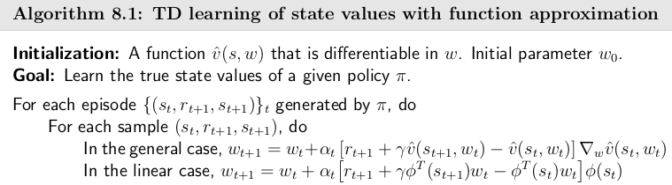
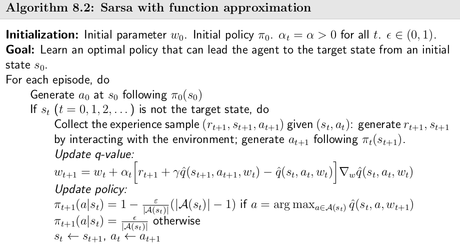
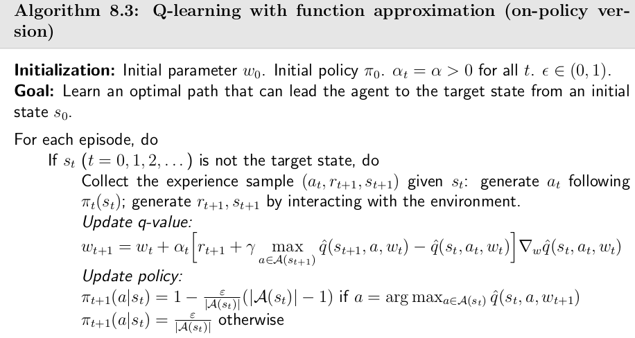
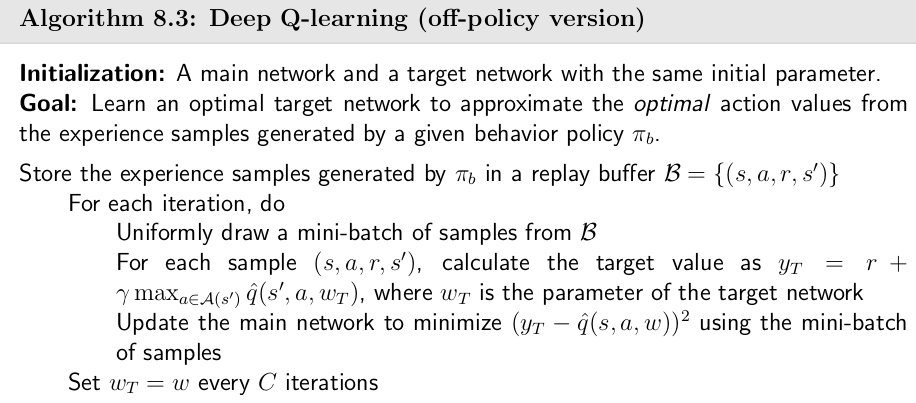
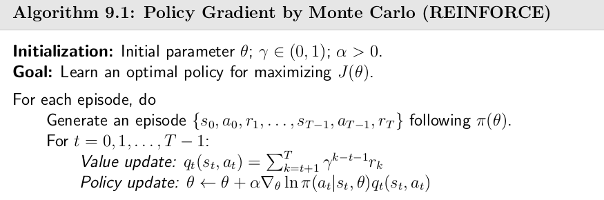
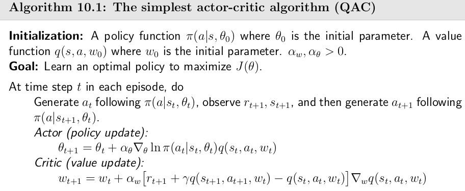
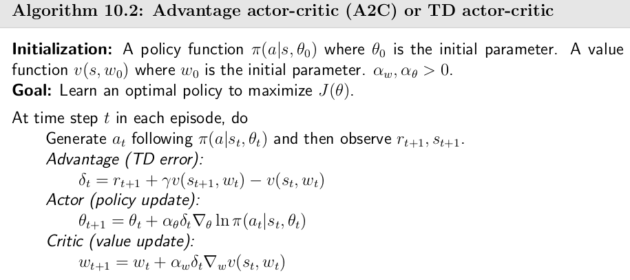
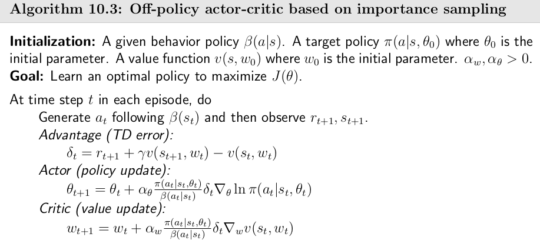

# 1.基本原理与公式

## 1.5 价值函数近似

​		记$v_\pi(s)$与$\hat{v}(s,w)$为真实状态价值函数与近似状态价值函数，寻找一个最优参数$w$使得下式目标函数最小
$$
J(w)=\mathbb{E}[((v_\pi(S)-\hat{v}(S,w))^2]
$$
​		为了消去随机变量$S$和期望运算，可以利用策略$\pi$下的马尔科夫平稳分布(Stationary distribution)$\{d_\pi(s)\}_{s\in S}$，即描述长时间内各个状态的出现概率来设定不同状态其值函数值在目标函数中的权重($d_\pi(s)$为状态转移概率$P_\pi$对应特征值为1的左特征向量)，此时目标函数变为
$$
J(w)=\sum_{s\in S} d_{\pi}(s) (v_\pi(s)-\hat{v}(s,w))^2
$$

### TD-learning状态值函数近似方法

​		对上述值函数近似优化问题进行求解，用随机梯度下降得到
$$
\begin{align}
w_{k+1}&=w_k - \alpha_k \grad_wJ(w_k) \\
&=w_k- \alpha_k \mathbb{E}[(v_\pi(S)-\hat{v}(S,w_k)^2] \\
&=w_k+ 2\alpha_k\mathbb{E}[(v_\pi(S)-\hat{v}(S,w_k)(\grad_w\hat{v}(S,w_k)] \\
\end{align}
$$
​		利用随机梯度下降消去期望运算
$$
w_{t+1}=w_t+ \alpha_t(v_\pi(s_t)-\hat{v}(s_t,w_t)(\grad_w\hat{v}(s_t,w_t))
$$
对于上式中的真实状态值函数$v_\pi$，可以使用蒙特卡洛方法通过episode得到$g(t)$代替，也可以使用时序差分方法中的$r_{t+1}+\gamma \hat{v}(s_{t+1},w_t)$代替，基于状态价值函数近似的TD-Learning表达式如下：
$$
w_{t+1}=w_t+ \alpha_t[(r_{t+1}+\gamma \hat{v}(s_{t+1},w_t))-\hat{v}(s_t,w_t)(\grad_w\hat{v}(s_t,w_t)]
$$

### TD-learning动作值函数近似方法

​		除了对状态值函数近似，还可以对动作状态值函数进行近似，即利用$\hat{q}(s,a,w)$去逼近$q(s,a)$，我们只需要将状态值函数近似的TD-learning公式中状态值函数项替换成动作值函数即可，Sarsa的函数近似公式如下：
$$
w_{t+1}=w_t+ \alpha_t[(r_{t+1}+\gamma \hat{q}(s_{t+1},a_{t+1},w_t))-\hat{q}(s_t,a_t,w_t)(\grad_w\hat{q}(s_t,a_t,w_t)]
$$
SARAS的函数近似伪代码如下：

​		同样Q-learning方法也可以进行动作状态函数近似，表达式如下：
$$
w_{t+1}=w_t+ \alpha_t[(r_{t+1}+\gamma \max_{a \in A(s_{t+1}) } \hat{q}(s_{t+1},a_{},w_t))-\hat{q}(s_t,a_t,w_t)(\grad_w\hat{q}(s_t,a_t,w_t)]
$$
​	Q-learning同样有着on-police与off-police两种模式，前者伪代码如下：

### Deep Q-learning

​		DQN是一种深度强化学习算法，对于简单的任务神经网络通常不需要“太深”，一两个隐藏层足矣。Deep Q-learning最小化的目标函数（可看作为bellman最优误差的平方）为
$$
J=\mathbb{E}[ (R+\max_{a \in A(S^{'} )} \hat{q}(S^{'},a,w)-\hat{q}(S,A,w))^2]
$$
为了简便计算梯度，我们将引入两个网络，一个是用来生成估计Q值$y_M=\hat{q}(S,A,w))$的**main network**，一个是用来生成期望的Q值及时序差分定义的TD目标$y_T=R+ \max _{a \in A(S^{'} )} \hat{q}(S^{'},a,w_T)$的**target network**，假设$w_T$在target network训练短期内是不变的，此时梯度表达式将得到简化，通常我们并不直接使用梯度表达式，而是使用深度学习的一些软件方法。起初我们通过设置两个网络有相同的$w$，main network通过样本不断更新参数w，而target network则是固定使用main network里一个比较旧的参数$w_T$，固定周期内更新。

​		同时DQN还引入了**经验回放**（experience replay）方法，具体做法为维护一个**回放缓冲区**(replay buffer)，将每次从环境中采样得到的四元组数据$(s,a,r,s^{'})$存储到replay buffer中，训练 main network的时候再从回放缓冲区中随机采样mini-batch来进行训练。从replay buffer中取(S,A)是均匀抽取的，这样就可以保证采样得到的(S,A)是均匀分布同时打破由于behavior policy采样得到样本(S,A)间的关联性。伪代码如下：

## 1.6 策略梯度

​		对于基于表格的离散策略，策略的寻优可以直接比较状态值函数选取使得所有状态的状态值函数均取最大值，若策略用状态的函数来表示如$\pi(a|s,\theta)$，$\theta$为策略函数的可调参数，便需要定义标量的metrics来进行最优策略的选取。

### 最优策略的metrics

​		第一种标量度量为状态值函数的平均(average state value)，定义为
$$
\bar v _\pi =\sum_{s \in S} d(s) v_\pi(s)=\mathbb E_{S\sim d} [v_ \pi (S)]
$$
式中$d(s)$表示着不同状态其值函数的权重，也可理解为状态在分布$d$下的值函数期望；$d$分布可以是均匀分布及各状态同等重要，也可关心某些特殊状态。$d$还可以依赖于策略，通常会选取在策略$\pi$下的stationary distribution$d_\pi$。	

​		$\bar{v}_\pi$还有两种等价形式
$$
\begin{aligned}
\mathbb{E}\left[\sum_{t=0}^{\infty}\gamma^{t}R_{t+1}\right]& =\sum_{s\in\mathcal{S}}d(s)\mathbb{E}\left[\sum_{t=0}^{\infty}\gamma^{t}R_{t+1}|S_{0}=s\right] \\
&=\sum_{s\in\mathcal{S}}d(s)v_{\pi}(s) \\
&=\bar{v}_{\pi}.
\end{aligned}
$$
​		第二种标量度量为奖励平均值(average reward)，即所有一步奖励的平均：
$$
\begin{aligned}\bar r_\pi&\doteq\sum_{s\in\mathcal S}d_\pi(s)r_\pi(s)=\mathbb E_{S\sim d_\pi}[r_\pi(S)] \\
&=\sum_{a\in\mathcal{A}}\pi(a|s,\theta)r(s,a)=\mathbb{E}_{A\sim\pi(s,\theta)}[r(s,A)|s]

\end{aligned}
$$
也可写为
$$
J(\theta)=\lim_{n\to\infty}\frac{1}{n}\mathbb{E}\left[\sum_{t=0}^{n-1}R_{t+1}\right] =\sum_{s\in\mathcal{S}}d_{\pi}(s)r_{\pi}(s)=\bar{r}_{\pi}
$$
当折扣因子$\gamma$不为0时，$\bar v _\pi$与$\bar r _\pi$有如下关系（利用贝尔曼最方程推出）
$$
\bar r_\pi = (1 - \gamma)\bar v _\pi
$$

### metrics的梯度

​		定义好标量度量后，需要利用梯度方法来进行求解，直接给出**策略梯度理论**：
$$
\begin{align}
\nabla_{\theta}J(\theta) &=\sum_{s\in\mathcal{S}}\eta(s)\sum_{a\in\mathcal{A}}\nabla_{\theta}\pi(a|s,\theta)q_{\pi}(s,a) \\
&=\mathbb{E}_{S\sim\eta,A\sim\pi(S,\theta)}\Big[\nabla_{\theta}\ln\pi(A|S,\theta)q_{\pi}(S,A)\Big]
\end{align}
$$
式中$\eta$为状态分布，上下代换涉及等式$\nabla_\theta\ln\pi(a|s,\theta)=\frac{\nabla_\theta\pi(a|s,\theta)}{\pi(a|s,\theta)}$ 。策略需满足$\pi(a|s,\theta)\in[0,1]$，通常在神经网络输出层利用softmax层实现。由于目标函数要求$A\sim\pi$，且后续梯度算法也是更新$\pi$因此为On-Policy。

### 蒙特卡洛策略梯度方法

​		利用梯度算法来进行策略参数的寻优，由于式中的梯度期望未知，可以使用随机梯度方法近似：
$$
\begin{aligned}
\theta_{t+1}& =\theta_t+\alpha\nabla_\theta J(\theta_t) \\
&=\theta_{t}+\alpha\mathbb{E}\bigg[\nabla_{\theta}\ln\pi(A|S,\theta_{t})q_{\pi}(S,A)\bigg] \\
&=\theta_{t}+\alpha \nabla_{\theta}\ln\pi(a_t|s_t,\theta_{t})q_{t}(s_t,a_t)
\end{aligned}
$$
若$q_t(s_t,a_t)$是利用蒙特卡洛估计得，便称为**REINFORCE**或**Monte Carlo policy gradient**。对上式进行变形分析：
$$
\begin{align}
\theta_{t+1}&=\theta_{t}+\alpha\underbrace{\left(\frac{q_{t}(s_{t},a_{t})}{\pi(a_{t}|s_{t},\theta_{t})}\right)}_{\beta_t}\nabla_{\theta}\pi(a_{t}|s_{t},\theta_{t}) \\
&=\theta_t+\alpha\beta_t\nabla_\theta\pi(a_t|s_t,\theta_t)
\end{align}
$$
$\alpha$为定常学习率，$\beta_t$的分母分子表明了当$q_t$较大时会提高策略在该动作的概率来利用，当$\pi(a_t|s_t,\theta_t)$越小的时候会增大该动作概率来进行探索。伪代码如下：

## 1.7 Actor-Critic Methods

### Q actor-critic算法

​		将saras的动作值函数近似与基于梯度的策略更新结合起来便是一个最简单的Q Action-Critic算法：
$$
\begin{aligned}
w_{t+1}&=w_t+ \alpha_w[(r_{t+1}+\gamma \hat{q}(s_{t+1},a_{t+1},w_t))-\hat{q}(s_t,a_t,w_t)(\grad_w\hat{q}(s_t,a_t,w_t)]
 \\
\theta_{t+1}&=\theta_t+\alpha_\theta \nabla_\theta\ln\pi(a_t|s_t,\theta_t)q_t(s_t,a_t)
\end{aligned}
$$

### Advance actor-critic(A2C / TD AC)

​		对于策略标量度量的梯度，通过证明可以得到对其加一项baseline如$b(s)$并不改变其梯度期望值，但会改变其梯度方差，在此基础上我们寻找合适的baseline使得梯度期望值不变，但方差最小：
$$
\begin{align}
\mathbb{E}_{S\sim\eta,A\sim\pi}\Big[\nabla_\theta\ln\pi(A|S,\theta_t)q_\pi(S,A)\Big]=\mathbb{E}_{S\sim\eta,A\sim\pi}\Big[\nabla_\theta\ln\pi(A|S,\theta_t)(q_\pi(S,A)-b(S))\Big]
\end{align}
$$
将方差带入得到的最优$b^*(s)$较为复杂，我们选取一个形式简单的次优$b^{\dagger}(s)$
$$
b^{\dagger}(s)=\mathbb{E}_{A\sim\pi}[q_{\pi}(s,A)]=v_{\pi}(s),\quad s\in\mathcal{S}
$$
得到**Advance actor-critic**的算法(stochastic version)如下
$$
\theta_{t+1}=\theta_{t}+\alpha\nabla_{\theta}\ln\pi(a_{t}|s_{t},\theta_{t})[q_{t}(s_{t},a_{t})-v_{t}(s_{t})]\\=\theta_{t}+\alpha\nabla_{\theta}\ln\pi(a_{t}|s_{t},\theta_{t})\delta_{t}(s_{t},a_{t}),
$$
式中$\delta_{t}(s_{t},a_{t}) = q_{t}(s_{t},a_{t})-v_{t}(s_{t})$为**优势函数**，相比传统QAC有着更好的性能（类似相对误差）。利用TD误差可简化为
$$
\delta_{t}(s_{t},a_{t}) = q_t(s_t,a_t)-v_t(s_t)\approx r_{t+1}+\gamma v_t(s_{t+1})-v_t(s_t)
$$

### Off-policy actor-critic

​		为了实现off-policy需要引入重要采样定理。在此我们使用简化版的表达，我们期望利用一个分布采样得到的样本去估计另一个分布的期望值，有如下表达式：
$$
\begin{align}
\mathbb{E}_{X\sim p_0}[X]=\sum_{x\in\mathcal{X}}p_0(x)x&=\sum_{x\in\mathcal{X}}p_1(x)\underbrace{\frac{p_0(x)}{p_1(x)}x}_{f(x)}=\mathbb{E}_{X\sim p_1}[f(X)] \\
&\approx\bar{f}=\frac{1}{n}\sum_{i=1}^{n}f(x_{i})=\frac{1}{n}\sum_{i=1}^{n}\underbrace{\frac{p_{0}(x_{i})}{p_{1}(x_{i})}}_{\text{importance}\atop\text{weight}}x_{i}
\end{align}
$$
因此Off-policy policy gradient在$\gamma <1$时的表达式为
$$
\nabla_{\theta}J(\theta)=\mathbb{E}_{S\sim\rho,A\sim\beta}\bigg[\underbrace{\frac{\pi(A|S,\theta)}{\beta(A|S)}}_{importance}\nabla_{\theta}\ln\pi(A|S,\theta)q_{\pi}(S,A)\bigg]
$$
显然表达式多了一项重要权重，同时要注意此处设计$\pi$与$\beta$两种策略分布。

