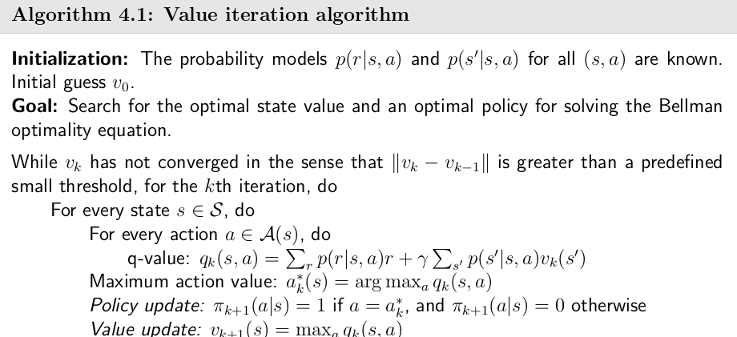
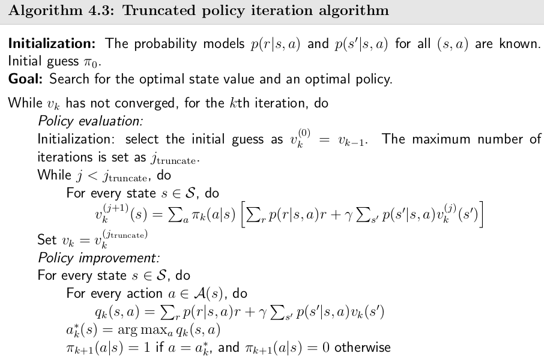
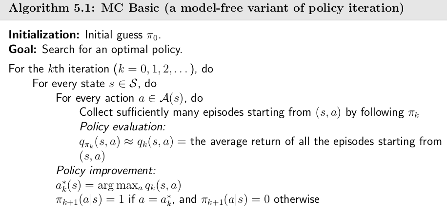
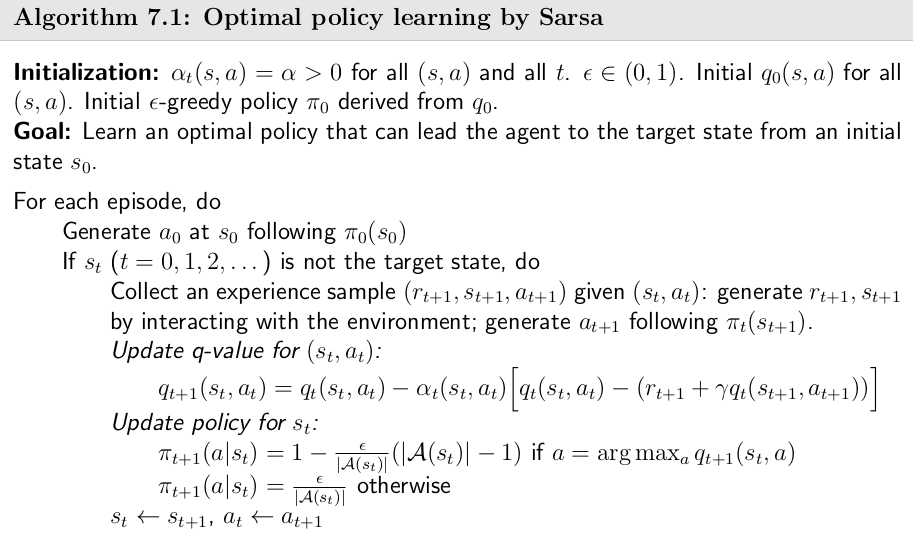
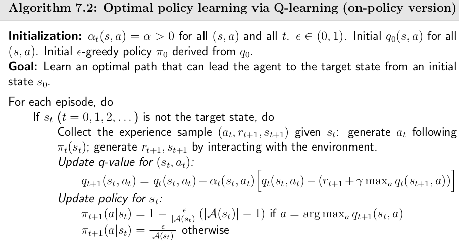
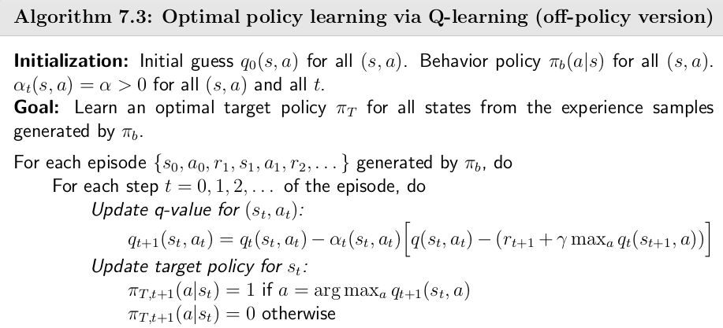
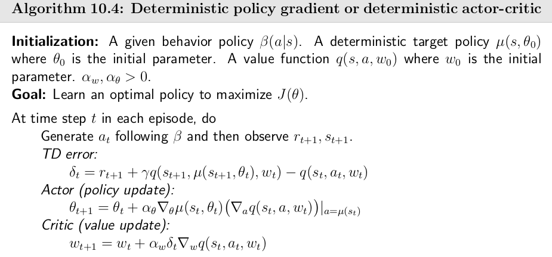

# 1.基本原理与公式

## 1.1 马尔科夫决策

马尔科夫决策过程：将动作（策略）和回报考虑在内的马尔科夫过程。

马尔科夫决策过程由元组 $(S, A, P, R, \gamma)$  描述，其中：

$S$	为有限的状态集

$A$	为有限的动作集

$P$	为状态转移概率

$R$	为回报函数

$\gamma$	为折扣因子，用来计算累积回报

强化学习的目标是给定一个马尔科夫决策过程，寻找最优策略。所谓策略是指状态到动作的映射，策略通常用符号 $\pi$ 表示，它是指给定状态 $s$ 时，动作集上的一个分布，即

$$
\pi(a | s) = p[A_t = a|S_t = s]
$$

即策略的定义是用条件概率分布给出的。公式（ $1$ ）的含义是：策略 $\pi$ 在每个状态 $s$ 指定一个动作概率。如果给出的策略 $\pi$ 是确定性的，那么策略 $\pi$ 在每个状态 $s$ 指定一个确定的动作。

当给定一个策略 $\pi$ 时，就可以计算累积回报。首先定义累积回报： 

$$
G_t = R_{t+1} + \gamma R_{t+2} + \cdots = \sum^{\infty}_{k=0} \gamma^k R_{t+k+1}
$$

由于策略 $\pi$ 是随机的，因此累积回报也是随机的。为了评价状态 $s_1$ 的价值，我们需要定义一个确定量来描述状态 $s_1$ 的价值，很自然的想法是利用累积回报来衡量状态 $s_1$ 的价值。然而，累积回报 $G_1$ 是一个随机变量，不是一个确定值，因此无法描述，但其期望是个确定值，可以作为状态值函数的定义。

### 状态值函数与行为-状态值函数

​		当智能体采用策略 $\pi$ 时，累积回报服从一个分布，累积回报在状态 $s$ 处的期望值定义为**状态-值函数**： 

$$
\nu_{\pi}(s) = E_{\pi}[\sum^{\infty}_{k=0} \gamma^k R_{t+k+1} | S_t = s]
$$

注意：状态值函数是与策略 $\pi$ 相对应的，这是因为策略 $\pi$ 决定了累积回报 $G$ 的状态分布。对应的**贝尔曼方程**为:
$$
\begin{align}
v_\pi(s) = r_ \pi(s) + \gamma \sum_{s^{'}\in S} p_\pi (s^{'}|s) v_ \pi(s^{'}) 
\end{align}
$$
式中
$$
\begin{align}

r_{\pi}  (s)\doteq\sum_{a\in\mathcal{A}}\pi(a|s)\sum_{r\in\mathcal{R}}p(r|s,a)r\\p_{\pi}(s'|s)\doteq\sum_{a\in\mathcal{A}}\pi(a|s)p(s'|s,a).
\end{align}
$$
**状态-行为值**函数采取某个action下得到的回报为 
$$
q_{\pi}(s,a) = E_{\pi}[\sum^{\infty}_{k=0} \gamma^k R_{t+k+1} | S_t = s, A_t = a]
$$

对应的bellman方程为
$$
q_\pi(s,a)=\sum_{r\in\mathcal R}p(r|s,a)r+\gamma\sum_{s'\in\mathcal S}p(s'|s,a)v_\pi(s')
$$
​		贝尔曼最优方程为：
$$
\begin{aligned}
v(s)& =\operatorname*{max}_{\pi(s)\in\Pi(s)}\sum_{a\in\mathcal{A}}\pi(a|s)\left(\sum_{r\in\mathcal{R}}p(r|s,a)r+\gamma\sum_{s^{\prime}\in\mathcal{S}}p(s^{\prime}|s,a)v(s^{\prime})\right) \\
&=\max_{\pi(s)\in\Pi(s)}\sum_{a\in\mathcal{A}}\pi(a|s)q(s,a),
\end{aligned}
$$
矩阵形式为
$$
v = \max_{\pi \in \Pi}(r_\pi + \gamma P_\pi v)
$$
求解贝尔曼方程通常采取迭代算法而不是数值解，迭代计算的收敛性依赖于压缩映射原理。

## 1.2 策略迭代与值迭代

​		基于动态规划的强化学习算法主要有两种：一是**策略迭代**（policy iteration），二是**价值迭代**（value iteration）。其中，策略迭代由两部分组成：**策略评估**（policy evaluation）和**策略提升**（policy improvement）。具体来说，策略迭代中的策略评估使用贝尔曼期望方程来得到一个策略的状态价值函数，这是一个动态规划的过程；而价值迭代直接使用贝尔曼最优方程来进行动态规划，得到最终的最优状态价值。基于动态规划的强化学习要求已知状态转移函数与奖励函数，同时通常也只适用于有限马尔科夫决策。

### 值迭代

​		值迭代算法利用压缩映射原理来求解bellman最优方程，在第k个步长内如下进行：

(1)更新策略$\pi _{k+1}$，即使用贪心算法对每一个状态s选取其奖励最大的动作$a^*_k(s)=\text{arg }max_a q_k(s,a)$。
$$
\pi_{k+1}(s)=\arg\max_\pi\sum_a\pi(a|s)\underbrace{\left(\sum_rp(r|s,a)r+\gamma\sum_{s'}p(s'|s,a)v_k(s')\right)}_{q_k(s,a)},\quad s\in\mathcal{S}.
$$
(2)更新值函数$v_{k+1}(s)$
$$
\begin{align}
v_{k+1}(s)&=\sum_a\pi_{k+1}(a|s)\underbrace{\left(\sum_rp(r|s,a)r+\gamma\sum_{s'}p(s'|s,a)v_k(s')\right)}_{q_k(s,a)},\quad s\in\mathcal{S}. \\
&= \max_{a} q_k(s,a)
\end{align}
$$
伪代码如下：

### 策略迭代

​		策略迭代分为策略评估与策略提升两部分，策略评估用来计算一个策略的状态价值函数，其利用动态规划思想，将贝克曼期望方程进行不断迭代来计算结果。

(1)在策略评估阶段通过迭代求解一个固定策略$\pi$的$v_{\pi_k}$：
$$
v_{\pi_k}^{(j+1)}(s)=\sum_a\pi_k(a|s)\left(\sum_rp(r|s,a)r+\gamma\sum_{s'}p(s'|s,a)v_{\pi_k}^{(j)}(s')\right),\quad s\in\mathcal{S},
$$
(2)在策略提升阶段对策略进行更新，使得$a^*_k(s)=\text{arg }max_a q_{\pi_k}(s,a)$。
$$
\pi_{k+1}(s)=\arg\max_\pi\sum_a\pi(a|s)\underbrace{\left(\sum_rp(r|s,a)r+\gamma\sum_{s'}p(s'|s,a)v_{\pi_k}(s')\right)}_{q_{\pi_k}(s,a)},\quad s\in\mathcal{S}
$$

### 截断策略迭代

​		策略迭代包括两个流程，一个是迭代当前策略对应的状态值函数的策略评估，一个是根据迭代后的值函数贪心更新策略的策略提升。若策略评估只进行有限步，在收敛前便结束进入策略提升，便称为截断策略迭代，也可称为广义策略迭代(GPI)，伪代码如下：

​		一般来说，收敛速度为策略迭代大于值迭代，截断策略迭代介于二者之间。

## 1.3 Monte carlo方法

强化学习算法的精髓之一是解决无模型的马尔科夫决策问题。基于值函数的无模型的强化学习算法主要包括蒙特卡洛方法和时间差分方法。

对于模型已知的马尔科夫决策过程，可以采用动态规划的方法解决，即策略迭代和值迭代。这两种方法可以用广义策略迭代方法统一：即先进行策略评估，也就是计算当前策略所对应的值函数，再利用值函数改进当前策略。无模型的强化学习基本思想也是如此，即：策略评估和策略改善。

在动态规划的方法中，值函数的计算公式利用了模型 $P(s'|s,a)$ ，而在无模型强化学习中，模型 $P(s'|s,a)$ 是未知的。⽆模型的强化学习算法要想利⽤策略评估和策略改善的框架，必须采⽤其他的⽅法评估当前策略（计算值函数）。

我们回到值函数最原始的定义公式：
$$
\nu_{\pi}(s) = E_{\pi}[G_t|S_t=s] = E_{\pi}[\sum^{\infty}_{k=0}\gamma^k R_{t+k+1} | S_t=s]
$$

$$
q_{\pi}(s) = E_{\pi}[\sum^{\infty}_{k=0}\gamma^k R_{t+k+1} | S_t=s,A_t=a]
$$

状态值函数和⾏为值函数的计算实际上是计算返回值的期望，动态规划的⽅法是利⽤模型计算该期望。在没有模型时，我们可以采⽤蒙特卡洛的⽅法计算该期望，即利⽤随机样本估计期望。在计算值函数时，蒙特卡洛⽅法是利⽤**经验平均**代替随机变量的期望。此处，我们要理解两个词：经验和平均。

**什么是“经验”**

当要评估智能体的当前策略 $\pi$ 时，我们可以利用策略 $\pi$ 产生很多次试验，每次试验都是从任意的初始状态开始直到终止，比如一次试验为 $S_1,A_1,R_2,\cdots,S_T$ ，计算一次试验中状态 $s$ 处的折扣回报返回值为 $G_t(s) = R_{t+1} + \gamma R_{t+2} + \cdots + \gamma^{T-1} R_T$ ，那么经验就是指利用该策略做很多次试验，产生很多幕数据。

**什么是“平均”**

平均就是求平均值。 利⽤蒙特卡罗⽅法求状态 $s$ 处的值函数时，⼜可以分为第⼀次访问蒙特卡洛⽅法和每次访问蒙特卡洛⽅法。

第一次访问蒙特卡洛方法是指在计算状态 $s$ 处的值函数时，只利用每次试验中第一次访问到状态 $s$ 时的返回值。如上图中第一次试验所示，计算状态 $s$ 处的均值只利用 $G_{11}$ ，因此，第一次访问蒙特卡洛方法的计算公式为
$$
\nu(s) = \frac{G_{11}(s) + G_{21}(s) + \cdots}{N(s)}
$$
每次访问蒙特卡洛方法是指在计算状态 $s$ 处的值函数，利用所有访问到状态 $s$ 时的回报返回值，即
$$
\nu(s) = \frac{G_{11}(s) + G_{12}(s) + \cdots + G_{21}(s) + \cdots}{N(s)}
$$
根据大数定律： $\nu(s) \to \nu_{\pi}(s)\ \text{as} \ N(s) \to \infty$ 。

由于智能体与环境交互的模型是未知的，蒙特卡洛⽅法是利⽤经验平均来估计值函数，⽽能否得到正确的值函数，则取决于经验——因此，如何获得充⾜的经验是⽆模型强化学习的核⼼所在。

伪代码如下：

### Exploring starts及贪心策略

​		MC采样可以使用多种方法来提高效率。一种提高样本利用效率的方法是，将每一个生成的episode分为起点更晚的多个subsequent，一个trajectory将被充分利用。同时在一个episode中可能会涉及到一个状态动作对的多次访问，如果一个状态动作对(s,a)在多次访问中只计算一次，则称为 **first-visit**，如果每次访问到都进行计算则称之为every-visit。

​		在动态规划⽅法中，为了保证值函数的收敛性，算法会逐个扫描状态空间中的状态。⽆模型的⽅法充分评估策略值函数的前提是每个状态都能被访问到，因此，在蒙特卡洛⽅法中必须采⽤⼀定的⽅法保证每个状态都能被访问到，⽅法之⼀是**探索性初始化**。

​		探索性初始化是指每个状态都有一定几率作为初始状态。在学习基于探索性初始化的蒙特卡洛方法前，需要先了解策略改善方法，以及便于进行迭代计算的平均方法。

同时介绍常见的两种策略

（1）贪婪策略。

$$
\pi_*(a|s) = \begin{cases} 1 & \text{if} \ a = \arg \underset{a \in A}{\text{max}} \ q_*(s,a) \\ 0 & \text{otherwise} \end{cases}
$$

贪婪策略是一个确定性策略，即只有在使得动作值函数 $q^*(s,a)$ 最大的动作处取概率1,选其他动作的概率为0。

（2） $\epsilon$ - greedy 策略。

$$
\pi(a|s) \gets \begin{cases}  1-\epsilon + \frac{\epsilon}{|A(s)|} & \text{if} \ a = \text{argmax}_a Q(s,a) \\ \frac{\epsilon}{|A(s)|} & \text{if} \ a \neq \text{argmax}_a Q(s,a)  \end{cases}
$$

$\epsilon$ - greedy策略是强化学习最基本最常用的随机策略。其含义是选取使得动作值函数最大的动作的概率为 $1-\epsilon + \frac{\epsilon}{|A(s)|}$ ，而其他动作的概率为等概率，都为 $\frac{\epsilon}{|A(s)|}$ 。 $\epsilon$ - greedy平衡了利用（exploitation）和探索（exploration），其中选取动作值函数最大的部分为利用，其他非最优动作仍有概率为探索部分。

### On/Off policy

(1)同策略。

同策略（on-policy）是指产⽣数据的策略与评估和要改善的策略是同⼀个策略。⽐如，要产⽣数据的策略和评估及要改善的策略都是 $\epsilon-soft$ 策略。其伪代码如下所示。

(2)异策略。

异策略（off-policy）是指产⽣数据的策略与评估和改善的策略不是同⼀个策略。我们用 $\pi$ 表示来评估和改善的策略，用 $\mu$ 表示产⽣样本数据的策略。异策略可以保证充分的探索性。例如用来评估和改善的策略 $\pi$ 是贪婪策略，用于产生数据的探索性策略 $\mu$  为探索性策略。

用于异策略的目标策略 $\pi$ 和行动策略 $\mu$ 并非任意选择的，而是必须满足一定的条件。这个条件是覆盖性条件，即行动策略 $\mu$ 产生的行为覆盖或包含目标策略 $\pi$ 产生的行为。利用式子表示：满足 $\pi(a|s) > 0$ 的任何 $(s,a)$ 均满足 $\mu(a|s) > 0$ 。

## 1.4 Temporal-Difference时序差分

​		时序差分是一种用来估计一个策略的价值函数的方法，它结合了蒙特卡洛和动态规划算法的思想。时序差分方法和蒙特卡洛的相似之处在于可以从样本数据中学习，不需要事先知道环境。相比较于MC需要一个完整的episode才可进行计算，时序差分则是在episode步进的每一步中进行计算，**状态值函数的TD算法**估计的公式如下：
$$
\begin{aligned}&v_{t+1}(s_{t})=v_{t}(s_{t})+\alpha_{t}(s_{t})\Big[\big(r_{t+1}+\gamma v_{t}(s_{t+1})\big) -v_{t}(s_{t})\Big],\\&v_{t+1}(s)=v_{t}(s),\quad\mathrm{for~all~}s\neq s_{t},\end{aligned}
$$
其推导见*Robbins-Monro*算法，式中$\bar{v}_t =r_{t+1}+\gamma v_t(s_{t+1})$定义为**TD目标**，$\delta_t=\bar{v}_t -v_t(s_{t+1})$被称为**TD误差**，$\alpha_t$定义为学习率。

### Sarsa-动作值函数的TD方法

​		利用TD思想进行动作值函数的估计，需要采样$(s_t,a_t,r_{t+1},s_{t+1},a_{t+1})$五元组，公式如下：
$$
\begin{aligned}q_{t+1}(s_{t},a_{t})&=q_{t}(s_{t},a_{t})-\alpha_{t}(s_{t},a_{t})\Big[q_{t}(s_{t},a_{t})-(r_{t+1}+\gamma q_{t}(s_{t+1},a_{t+1}))\Big],\\q_{t+1}(s,a)&=q_{t}(s,a),\quad\mathrm{for~all~}(s,a)\neq(s_{t},a_{t}),\end{aligned}
$$
该方法是**on-policy**的，伪代码如下：

### n-step Sarsa方法

​		介于MC与Sarsa方法还有一种n-step Sarsa方法，即通过一定步长的累计奖励值与下一状态动作对的Q值来进行计算，如下所示：
$$
\begin{aligned}
\mathrm{Sarsa}\leftarrow G_{t}^{(1)}& =R_{t+1}+\gamma q_{\pi}(S_{t+1},A_{t+1}), \\
G_{t}^{(2)}& =R_{t+1}+\gamma R_{t+2}+\gamma^{2}q_{\pi}(S_{t+2},A_{t+2}), \\
n\mathrm{-step~Sarsa}\longleftarrow\quad G_{t}^{(n)}& =R_{t+1}+\gamma R_{t+2}+\cdots+\gamma^nq_\pi(S_{t+n},A_{t+n}), \\
\mathrm{MC}\longleftarrow\quad G_{t}^{(\infty)}& =R_{t+1}+\gamma R_{t+2}+\gamma^{2}R_{t+3}+\gamma^{3}R_{t+4}\ldots 
\end{aligned}
$$
​		由于n步Sarsa包括Sarsa和MC学习作为两个极端情况，所以n步Sarsa的性能介于Sarsa和MC学习之间。如果选择n为较大的数，则n步Sarsa接近MC学习，估计值的方差相对较高，但偏差较小。如果n很小，n步Sarsa接近Sarsa:估计偏差较大，但方差较低。

### Q-learning-最优动作值函数的TD方法

​		由于Sarsa仅仅是迭代计算q值，因此只涉及策略评估阶段，还需结合策略提升才能进行使用。Q-learning是一种**估计最优动作值函数**来直接寻找最优策略的方法，公式如下：
$$
\begin{aligned}
q_{t+1}(s_{t},a_{t})& =q_{t}(s_{t},a_{t})-\alpha_{t}(s_{t},a_{t})\left[q_{t}(s_{t},a_{t})-\left(r_{t+1}+\gamma\max_{a\in\mathcal{A}(s_{t+1})}q_{t}(s_{t+1},a)\right)\right], \\
q_{t+1}(s,a)& =q_t(s,a),\quad\mathrm{for~all~}(s,a)\neq(s_t,a_t), 
\end{aligned}
$$
​		Q-learning是为了一种求解动作值函数形式下的bellman最优方程的随机近似算法，为off-policy，伪代码如下：

### TD通式

统一形式为
$$
q_{t+1}(s_t,a_t)=q_t(s_t,a_t)-\alpha_t(s_t,a_t)[q_t(s_t,a_t)-\bar{q}_t],
$$
有如下表格：
$$
\begin{array}{l|l}\hline\text{Algorithm}&\text{Expression of the TD target }\bar{q}_t\text{ in }(7.20)\\\hline\text{Sarsa}&\bar{q}_t=r_{t+1}+\gamma q_t(s_{t+1},a_{t+1})\\\hline\text{n-step Sarsa}&\bar{q}_t=r_{t+1}+\gamma r_{t+2}+\cdots+\gamma^nq_t(s_{t+n},a_{t+n})\\\hline\text{Q-learning}&\bar{q}_t=r_{t+1}+\gamma\max_aq_t(s_{t+1},a)\\\hline\text{Monte Carlo}&\bar{q}_t=r_{t+1}+\gamma r_{t+2}+\gamma^2r_{t+3}+\ldots\\\hline\end{array}
$$
对应的期望方程为
$$
\begin{array}{l|l}\hline\text{Algorithm}&\text{Equation to be solved}\\\hline\text{Sarsa}&\text{BE: }q_\pi(s,a)=\mathbb{E}\left[R_{t+1}+\gamma q_\pi(S_{t+1},A_{t+1})|S_t=s,A_t=a\right]\\\hline\text{n-step Sarsa}&\text{BE: }q_\pi(s,a)=\mathbb{E}\left[R_{t+1}+\gamma R_{t+2}+\cdots+\gamma^nq_\pi(S_{t+n},A_{t+n})|S_t=s,A_t=a\right]\\\hline\text{Q-learning}&\text{BOE: }q(s,a)=\mathbb{E}\left[R_{t+1}+\gamma\max_aq(S_{t+1},a)\right|S_t=s,A_t=a]\\\hline\text{Monte Carlo}&\text{BE: }q_\pi(s,a)=\mathbb{E}[R_{t+1}+\gamma R_{t+2}+\gamma^2R_{t+3}+\ldots|S_t=s,A_t=a]\\\hline\end{array}
$$

## 1.5 价值函数近似

​		记$v_\pi(s)$与$\hat{v}(s,w)$为真实状态价值函数与近似状态价值函数，寻找一个最优参数$w$使得下式目标函数最小
$$
J(w)=\mathbb{E}[((v_\pi(S)-\hat{v}(S,w))^2]
$$
​		为了消去随机变量$S$和期望运算，可以利用策略$\pi$下的马尔科夫平稳分布(Stationary distribution)$\{d_\pi(s)\}_{s\in S}$，即描述长时间内各个状态的出现概率来设定不同状态其值函数值在目标函数中的权重($d_\pi(s)$为状态转移概率$P_\pi$对应特征值为1的左特征向量)，此时目标函数变为
$$
J(w)=\sum_{s\in S} d_{\pi}(s) (v_\pi(s)-\hat{v}(s,w))^2
$$

### TD-learning状态值函数近似方法

​		对上述值函数近似优化问题进行求解，用随机梯度下降得到
$$
\begin{align}
w_{k+1}&=w_k - \alpha_k \grad_wJ(w_k) \\
&=w_k- \alpha_k \mathbb{E}[(v_\pi(S)-\hat{v}(S,w_k)^2] \\
&=w_k+ 2\alpha_k\mathbb{E}[(v_\pi(S)-\hat{v}(S,w_k)(\grad_w\hat{v}(S,w_k)] \\
\end{align}
$$
​		利用随机梯度下降消去期望运算
$$
w_{t+1}=w_t+ \alpha_t(v_\pi(s_t)-\hat{v}(s_t,w_t)(\grad_w\hat{v}(s_t,w_t))
$$
对于上式中的真实状态值函数$v_\pi$，可以使用蒙特卡洛方法通过episode得到$g(t)$代替，也可以使用时序差分方法中的$r_{t+1}+\gamma \hat{v}(s_{t+1},w_t)$代替，基于状态价值函数近似的TD-Learning表达式如下：
$$
w_{t+1}=w_t+ \alpha_t[(r_{t+1}+\gamma \hat{v}(s_{t+1},w_t))-\hat{v}(s_t,w_t)(\grad_w\hat{v}(s_t,w_t)]
$$

### TD-learning动作值函数近似方法

​		除了对状态值函数近似，还可以对动作状态值函数进行近似，即利用$\hat{q}(s,a,w)$去逼近$q(s,a)$，我们只需要将状态值函数近似的TD-learning公式中状态值函数项替换成动作值函数即可，Sarsa的函数近似公式如下：
$$
w_{t+1}=w_t+ \alpha_t[(r_{t+1}+\gamma \hat{q}(s_{t+1},a_{t+1},w_t))-\hat{q}(s_t,a_t,w_t)(\grad_w\hat{q}(s_t,a_t,w_t)]
$$
SARAS的函数近似伪代码如下：

​		同样Q-learning方法也可以进行动作状态函数近似，表达式如下：
$$
w_{t+1}=w_t+ \alpha_t[(r_{t+1}+\gamma \max_{a \in A(s_{t+1}) } \hat{q}(s_{t+1},a_{},w_t))-\hat{q}(s_t,a_t,w_t)(\grad_w\hat{q}(s_t,a_t,w_t)]
$$
​	Q-learning同样有着on-police与off-police两种模式，前者伪代码如下：

### Deep Q-learning

​		DQN是一种深度强化学习算法，对于简单的任务神经网络通常不需要“太深”，一两个隐藏层足矣。Deep Q-learning最小化的目标函数（可看作为bellman最优误差的平方）为
$$
J=\mathbb{E}[ (R+\max_{a \in A(S^{'} )} \hat{q}(S^{'},a,w)-\hat{q}(S,A,w))^2]
$$
为了简便计算梯度，我们将引入两个网络，一个是用来生成估计Q值$y_M=\hat{q}(S,A,w))$的**main network**，一个是用来生成期望的Q值及时序差分定义的TD目标$y_T=R+ \max _{a \in A(S^{'} )} \hat{q}(S^{'},a,w_T)$的**target network**，假设$w_T$在target network训练短期内是不变的，此时梯度表达式将得到简化，通常我们并不直接使用梯度表达式，而是使用深度学习的一些软件方法。起初我们通过设置两个网络有相同的$w$，main network通过样本不断更新参数w，而target network则是固定使用main network里一个比较旧的参数$w_T$，固定周期内更新。

​		同时DQN还引入了**经验回放**（experience replay）方法，具体做法为维护一个**回放缓冲区**(replay buffer)，将每次从环境中采样得到的四元组数据$(s,a,r,s^{'})$存储到replay buffer中，训练 main network的时候再从回放缓冲区中随机采样mini-batch来进行训练。从replay buffer中取(S,A)是均匀抽取的，这样就可以保证采样得到的(S,A)是均匀分布同时打破由于behavior policy采样得到样本(S,A)间的关联性。伪代码如下：

## 1.6 策略梯度

​		对于基于表格的离散策略，策略的寻优可以直接比较状态值函数选取使得所有状态的状态值函数均取最大值，若策略用状态的函数来表示如$\pi(a|s,\theta)$，$\theta$为策略函数的可调参数，便需要定义标量的metrics来进行最优策略的选取。

### 最优策略的metrics

​		第一种标量度量为状态值函数的平均(average state value)，定义为
$$
\bar v _\pi =\sum_{s \in S} d(s) v_\pi(s)=\mathbb E_{S\sim d} [v_ \pi (S)]
$$
式中$d(s)$表示着不同状态其值函数的权重，也可理解为状态在分布$d$下的值函数期望；$d$分布可以是均匀分布及各状态同等重要，也可关心某些特殊状态。$d$还可以依赖于策略，通常会选取在策略$\pi$下的stationary distribution$d_\pi$。	

​		$\bar{v}_\pi$还有两种等价形式
$$
\begin{aligned}
\mathbb{E}\left[\sum_{t=0}^{\infty}\gamma^{t}R_{t+1}\right]& =\sum_{s\in\mathcal{S}}d(s)\mathbb{E}\left[\sum_{t=0}^{\infty}\gamma^{t}R_{t+1}|S_{0}=s\right] \\
&=\sum_{s\in\mathcal{S}}d(s)v_{\pi}(s) \\
&=\bar{v}_{\pi}.
\end{aligned}
$$
​		第二种标量度量为奖励平均值(average reward)，即所有一步奖励的平均：
$$
\begin{aligned}\bar r_\pi&\doteq\sum_{s\in\mathcal S}d_\pi(s)r_\pi(s)=\mathbb E_{S\sim d_\pi}[r_\pi(S)] \\
&=\sum_{a\in\mathcal{A}}\pi(a|s,\theta)r(s,a)=\mathbb{E}_{A\sim\pi(s,\theta)}[r(s,A)|s]

\end{aligned}
$$
也可写为
$$
J(\theta)=\lim_{n\to\infty}\frac{1}{n}\mathbb{E}\left[\sum_{t=0}^{n-1}R_{t+1}\right] =\sum_{s\in\mathcal{S}}d_{\pi}(s)r_{\pi}(s)=\bar{r}_{\pi}
$$
当折扣因子$\gamma$不为0时，$\bar v _\pi$与$\bar r _\pi$有如下关系（利用贝尔曼最方程推出）
$$
\bar r_\pi = (1 - \gamma)\bar v _\pi
$$

### metrics的梯度

​		定义好标量度量后，需要利用梯度方法来进行求解，直接给出**策略梯度理论**：
$$
\begin{align}
\nabla_{\theta}J(\theta) &=\sum_{s\in\mathcal{S}}\eta(s)\sum_{a\in\mathcal{A}}\nabla_{\theta}\pi(a|s,\theta)q_{\pi}(s,a) \\
&=\mathbb{E}_{S\sim\eta,A\sim\pi(S,\theta)}\Big[\nabla_{\theta}\ln\pi(A|S,\theta)q_{\pi}(S,A)\Big]
\end{align}
$$
式中$\eta$为状态分布，上下代换涉及等式$\nabla_\theta\ln\pi(a|s,\theta)=\frac{\nabla_\theta\pi(a|s,\theta)}{\pi(a|s,\theta)}$ 。策略需满足$\pi(a|s,\theta)\in[0,1]$，通常在神经网络输出层利用softmax层实现。由于目标函数要求$A\sim\pi$，且后续梯度算法也是更新$\pi$因此为On-Policy。

### 蒙特卡洛策略梯度方法

​		利用梯度算法来进行策略参数的寻优，由于式中的梯度期望未知，可以使用随机梯度方法近似：
$$
\begin{aligned}
\theta_{t+1}& =\theta_t+\alpha\nabla_\theta J(\theta_t) \\
&=\theta_{t}+\alpha\mathbb{E}\bigg[\nabla_{\theta}\ln\pi(A|S,\theta_{t})q_{\pi}(S,A)\bigg] \\
&=\theta_{t}+\alpha \nabla_{\theta}\ln\pi(a_t|s_t,\theta_{t})q_{t}(s_t,a_t)
\end{aligned}
$$
若$q_t(s_t,a_t)$是利用蒙特卡洛估计得，便称为**REINFORCE**或**Monte Carlo policy gradient**。对上式进行变形分析：
$$
\begin{align}
\theta_{t+1}&=\theta_{t}+\alpha\underbrace{\left(\frac{q_{t}(s_{t},a_{t})}{\pi(a_{t}|s_{t},\theta_{t})}\right)}_{\beta_t}\nabla_{\theta}\pi(a_{t}|s_{t},\theta_{t}) \\
&=\theta_t+\alpha\beta_t\nabla_\theta\pi(a_t|s_t,\theta_t)
\end{align}
$$
$\alpha$为定常学习率，$\beta_t$的分母分子表明了当$q_t$较大时会提高策略在该动作的概率来利用，当$\pi(a_t|s_t,\theta_t)$越小的时候会增大该动作概率来进行探索。伪代码如下：

## 1.7 Actor-Critic Methods

### Q actor-critic算法

​		将saras的动作值函数近似与基于梯度的策略更新结合起来便是一个最简单的Q Action-Critic算法：
$$
\begin{aligned}
w_{t+1}&=w_t+ \alpha_w[(r_{t+1}+\gamma \hat{q}(s_{t+1},a_{t+1},w_t))-\hat{q}(s_t,a_t,w_t)(\grad_w\hat{q}(s_t,a_t,w_t)]
 \\
\theta_{t+1}&=\theta_t+\alpha_\theta \nabla_\theta\ln\pi(a_t|s_t,\theta_t)q_t(s_t,a_t)
\end{aligned}
$$

### Advance actor-critic(A2C / TD AC)

​		对于策略标量度量的梯度，通过证明可以得到对其加一项baseline如$b(s)$并不改变其梯度期望值，但会改变其梯度方差，在此基础上我们寻找合适的baseline使得梯度期望值不变，但方差最小：
$$
\begin{align}
\mathbb{E}_{S\sim\eta,A\sim\pi}\Big[\nabla_\theta\ln\pi(A|S,\theta_t)q_\pi(S,A)\Big]=\mathbb{E}_{S\sim\eta,A\sim\pi}\Big[\nabla_\theta\ln\pi(A|S,\theta_t)(q_\pi(S,A)-b(S))\Big]
\end{align}
$$
将方差带入得到的最优$b^*(s)$较为复杂，我们选取一个形式简单的次优$b^{\dagger}(s)$
$$
b^{\dagger}(s)=\mathbb{E}_{A\sim\pi}[q_{\pi}(s,A)]=v_{\pi}(s),\quad s\in\mathcal{S}
$$
得到**Advance actor-critic**的算法(stochastic version)如下
$$
\theta_{t+1}=\theta_{t}+\alpha\nabla_{\theta}\ln\pi(a_{t}|s_{t},\theta_{t})[q_{t}(s_{t},a_{t})-v_{t}(s_{t})]\\=\theta_{t}+\alpha\nabla_{\theta}\ln\pi(a_{t}|s_{t},\theta_{t})\delta_{t}(s_{t},a_{t}),
$$
式中$\delta_{t}(s_{t},a_{t}) = q_{t}(s_{t},a_{t})-v_{t}(s_{t})$为**优势函数**，相比传统QAC有着更好的性能（类似相对误差）。利用TD误差可简化为
$$
\delta_{t}(s_{t},a_{t}) = q_t(s_t,a_t)-v_t(s_t)\approx r_{t+1}+\gamma v_t(s_{t+1})-v_t(s_t)
$$

### Off-policy actor-critic

​		为了实现off-policy需要引入重要[采样定理](https://mqshen.gitbooks.io/prml/content/Chapter11/basis/importance_sampling.html)。在此我们使用简化版的表达，我们期望利用一个分布采样得到的样本去估计另一个分布的期望值，有如下表达式：
$$
\begin{align}
\mathbb{E}_{X\sim p_0}[X]=\sum_{x\in\mathcal{X}}p_0(x)x&=\sum_{x\in\mathcal{X}}p_1(x)\underbrace{\frac{p_0(x)}{p_1(x)}x}_{f(x)}=\mathbb{E}_{X\sim p_1}[f(X)] \\
&\approx\bar{f}=\frac{1}{n}\sum_{i=1}^{n}f(x_{i})=\frac{1}{n}\sum_{i=1}^{n}\underbrace{\frac{p_{0}(x_{i})}{p_{1}(x_{i})}}_{\text{importance}\atop\text{weight}}x_{i}
\end{align}
$$
因此Off-policy policy gradient在$\gamma <1$时的表达式为
$$
\nabla_{\theta}J(\theta)=\mathbb{E}_{S\sim\rho,A\sim\beta}\bigg[\underbrace{\frac{\pi(A|S,\theta)}{\beta(A|S)}}_{importance}\nabla_{\theta}\ln\pi(A|S,\theta)q_{\pi}(S,A)\bigg]
$$
显然表达式多了一项重要权重，同时要注意此处设计$\pi$与$\beta$两种策略分布。

### Deterministic actor-critic算法（DPG）

​		对于策略我们通常给出一个状态下对应action的概率，若考虑确定性策略，即对应一个梯度状态策略会给出一个确定的action，即策略$\mu：S\sim A$或$a=\mu(s)$。

​		确定性策略梯度公式如下：
$$
\begin{aligned}\nabla_\theta J(\theta)&=\sum_{s\in\mathcal{S}}\eta(s)\nabla_\theta\mu(s)\big(\nabla_aq_\mu(s,a)\big)|_{a=\mu(s)}\\&=\mathbb{E}_{S\sim\eta}\left[\nabla_\theta\mu(S)\big(\nabla_aq_\mu(S,a)\big)|_{a=\mu(S)}\right]\end{aligned}
$$
式中$\eta $为状态的分布，同时由于确定性策略并不会引入随机变量$A$，属于off-policy。[证明见pdf](./RF.asserts/Mathematical Foundations of Reinforcement Learning.pdf)

​		Deterministic policy gradient算法利用梯度上升法来实现策略标量度量的最大化，表达式如下：
$$
\begin{align}
\theta_{t +1}&=\theta_t+\alpha_\theta\mathbb{E}_{S\sim\eta}[\nabla_\theta\mu(S)\big(\nabla_aq_\mu(S,a)\big)|_{a=\mu(S)}] \\
&=\theta_{t}+\alpha_{\theta}\nabla_{\theta}\mu(s_{t})\big(\nabla_{a}q_{\mu}(s_{t},a)\big)|_{a=\mu(s_{t})}
\end{align}
$$

对于behavior策略$\beta$可以选取各种形式，也可以是基于概率的策略，只需要一定探索性即可。
