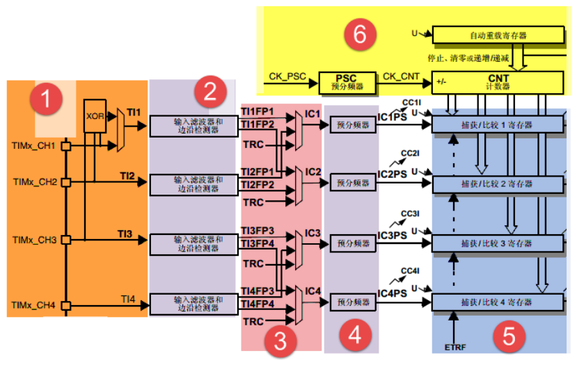

## 一.PWM的输入捕获

### 输入模式

### 

1. 原理

​	捕获跳变沿时的计数寄存器*CNT*的值。

2. 输入滤波器与边沿检测器

​	当输入信号存在高频干扰时，需要对输入信号进行重新采样，要求采样频率必须是输入频率的2倍以上。

​	边沿检测器决定捕获信号的是上升沿，下降沿或者双边沿。

3. 输入通道和捕获通道（_CHx 与_ICx）

​	输入通道：通过定时器的外部引脚连接到需要测量的信号源。

​	捕获通道：捕获输入信号边沿的通道。

4. 预分频器

​	用于决定多少个时间进行一次捕获，若不分频则捕获每一个边沿。

5. 捕获寄存器

​	经过预分频器的信号ICxPS 是最终被捕获的信号，当发生捕获时（第一次），计数器CNT 的值会被锁存到捕获寄存器CCR 中，还会产生CCxI 中断，相应的中断位CCxIF（在SR 寄存器中）会被置位，通过软件或者读取CCR 中的值可以将CCxIF 清0。如果发生第二次捕获（即重复捕获：CCR 寄存器中已捕获到计数器值且CCxIF 标志已置1），则捕获溢出标志位CCxOF（在SR 寄存器中）会被置位，CCxOF 只能通过软件清零。

### PWM输入模式

​	如图，需要两个捕获寄存器，配置好一路的触发输入的极性，另一路就会由硬件自动配置为相反的极性。当时用PWM输入模式的时候，需要将从模式配置为**复位模式**<!--即在启动触发信号进行捕获时，会将CNT计数器复位清零-->

二.
