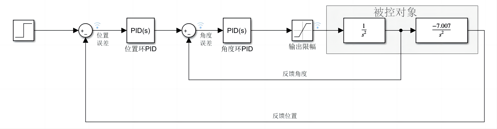
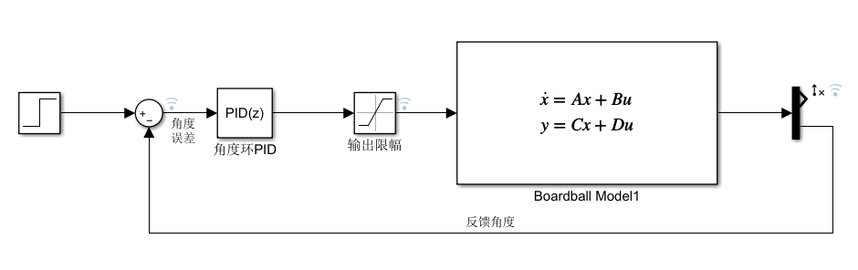
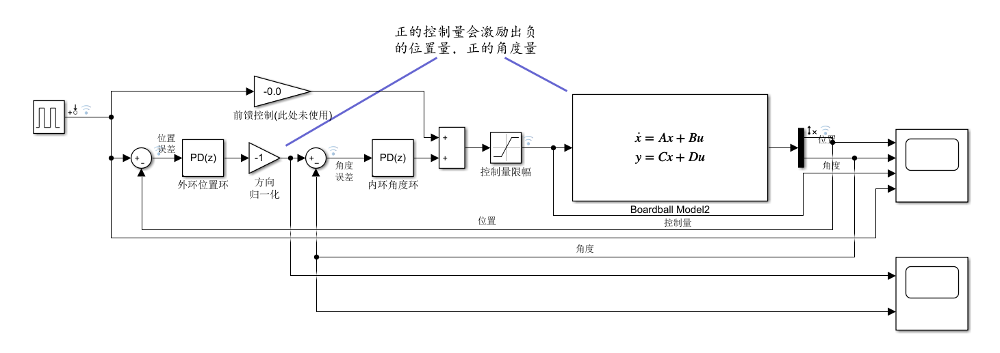
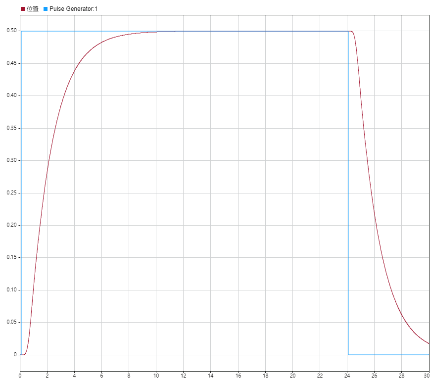
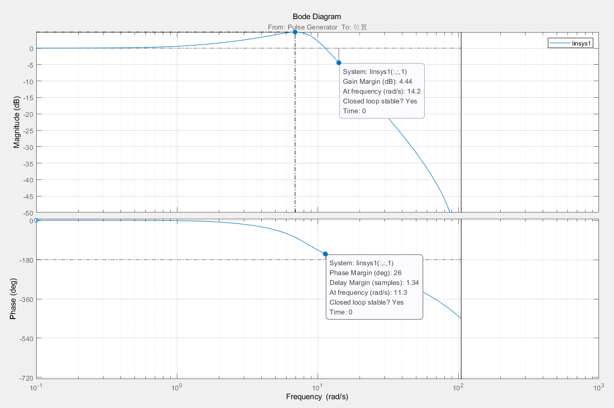
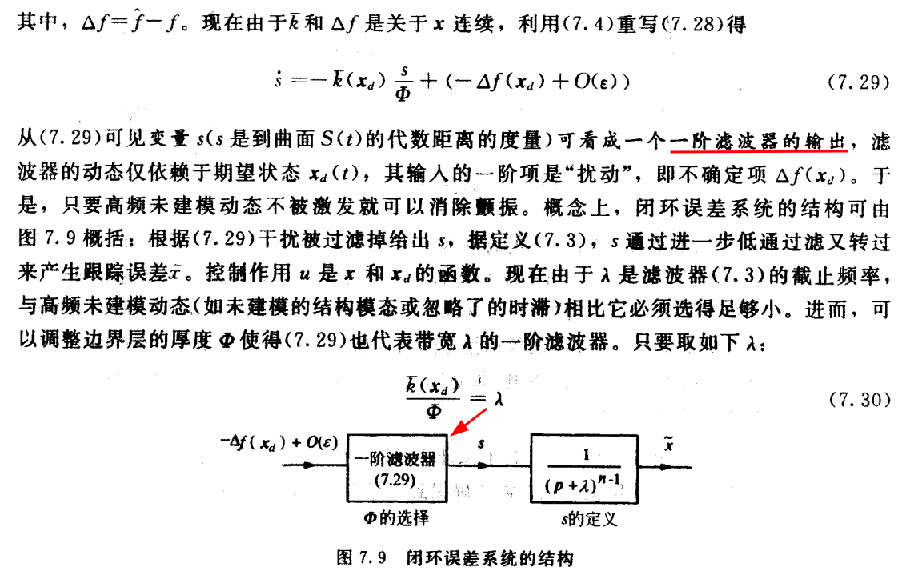

# 控制器的学习

## MPC模型预测控制

MPC是一种基于滚动时域的最优控制，一般分为三个步骤：1.预测系统未来动态 2.(数值)求解优化问题 3.将有化解的第一个元素(一部分作用于)系统

满足约束，接近最优控制（起码次优）

设计参数：

- 采样时间：建议选择开环响应时间的10-20个小区间

- 预测范围
- 控制范围
- 约束
- 权重

MPC Controller block

基本的输入：mo(输出测量值)    ref(跟踪目标值)

### 全状态反馈无约束线性MPC

1. 针对有限时域的最优求解

​		类似学习LQR是的状态调节器，我们先只考虑状态方程，且期望状态量收敛于0。
$$
\text{LTI:} \quad x(k+1)=Ax(k)+Bu(k) \qquad x\in\mathbb{R}^{n},u\in\mathbb{R}^{p}  \\
$$

定义$x(k+i|k),u(k+i|k)$为在k时刻对$k+i$时刻的预测，则可预测到未来$k+p$时刻的状态: 
$$
\begin{aligned}x(k+1\mid k)&=Ax( k)+Bu( k)\\x(k+2\mid k)&=A^2x(k)+ABu(0\mid k)+Bu(1\mid k)\\\vdots&\quad\vdots\quad\vdots\\x(k+i\mid k)&=A^ix( k)+A^{i-1}Bu(k)+A^{i-2}Bu(k+1\mid k)+\cdots+Bu(k+i-1\mid k)\end{aligned}
$$
写成紧凑形式（N：Control/Predictive horizon）：
$$
X(k)=Fx(k)+\Phi U(k) \\ \text{}
X(k)\triangleq\begin{bmatrix}x(k+1|k)\\x(k+2|k)\\\vdots\\x(k+N|k)\end{bmatrix}\quad U(k)\triangleq\begin{bmatrix}u(k+0|k)\\u(k+1|k)\\\vdots\\u(k+N-1|k)\end{bmatrix}\quad \\F=\begin{bmatrix}A\\A^2\\\vdots\\A^N\end{bmatrix}  \qquad \Phi=\begin{bmatrix}B&0\\AB&B&0\\\vdots\\A^{N-1}B&A^{N-2}B&\cdots&B\end{bmatrix}
$$
令代价函数为二次型形式，定义权重矩阵$\mathcal{Q},\mathcal{R}$：
$$
\mathcal{Q}=\begin{bmatrix}Q&&&\\&Q&&\\&&\ddots&\\&&&Q\end{bmatrix}\quad\mathcal{R}=\begin{bmatrix}R&&\\&R&&\\&&\ddots&\\&&&R\end{bmatrix}\\
\begin{aligned}
J(k)&=\sum_{i=1}^{N}\|x(i|k)\|_{Q}^{2}+\|u(i-1|k)\|_{R}^{2}\\&=X^{T}(k)\mathcal{Q}X(k)+U(k)^{T}\mathcal{R}U(k)
\\&=(Fx(k)+\Phi U(k))^{T}\mathcal{Q}(Fx(k)+\Phi U(k))+U^{T}(k){\mathcal{R}}U(k)\\
&=x^{T}(k)F^{T}\mathcal{Q}Fx(k)+2x^{T}(k)F^{T}\mathcal{Q}\Phi U(k)+U^{T}(k)(\Phi^{T}\mathcal{Q}\Phi+{\mathcal{R}})U(k) \end{aligned}
$$
对代价函数求极值：
$$
\left.\nabla_{U}\right|_{U=U^{*}}=\frac{\partial J}{\partial U}\Bigg|_{U=U^{*}}=0\\
\begin{gathered}
2x(k)^{T}F^{T}\mathcal{Q}\Phi+2U(k)^{T}(\Phi^{T}\mathcal{Q}\Phi+\mathcal{R})\bigg|_{U(k)=U^{*}}=0 \\
U^{*}(k)=-(\Phi^{T}\mathcal{Q}\Phi+{\mathcal{R}})^{-1}\Phi^{T}\mathcal{Q}Fx(k) \\
(R>0,Q\geq0;\text{ or }R\geq0,Q>0,\text{ and }\Phi\text{ is fully ranked}) 
\end{gathered}
$$
最终我们得到一个状态负反馈的最优控制律：
$$
u^{*}(k)=-[I_{p\times p}\text{ }0\cdots0](\Phi^{T}\mathcal{Q}\Phi+\mathcal{R})^{-1}\Phi^{T}\mathcal{Q}Fx(k)=-K_{mpc}x(k)
$$

2. 稳定性分析

​		在这里我们需要讨论一个问题，对于预测区间与控制区间均为有限值时，此时优化得到的最优控制并不能一定保证系统$x(k+1)=(A-BK_{mpc})x(k)$稳定，且区间越小，这种情况越有可能发生，故需要计算新系统的特征值来检验稳定性。因此我们需要考虑如何能够优化确保其闭环稳定性：

​		我们取预测/控制区间为无穷大(N = $\infty$)，假设在$k$时刻计算出的最优控制为$\{u^*(k+i|k),i=0,1,\dots\}$，则在$k+1$时刻至少存在一个可行解:
$$
u(k+i|k+1)=u^{*}(k+i+1|k),\quad i=0,1,\dots \\
\therefore J^{*}(k+1)-J^{*}(k)\leq J(k+1)-J^{*}(k)=-\|x(1\mid k)\|_{Q}^{2}-\|u(0\mid k)\|_{R}^{2}<0
$$
​		即可有lyapunov定理判断得到渐进稳定。

3. 针对无穷时域的最优求解

​		对于无穷时域下的代价函数，其通常有一个极限值：
$$
J(k)=\sum_{i=1}^{\infty}\|x(i|k)\|_{Q}^{2}+\|u(i-1|k)\|_{R}^{2}=\|x(k)\|_{P}^{2}-\|x(k)\|_{\mathcal{Q}}^{2}
$$
此处的$P$由离散系统的lyapunov方程求得，此处$K$并不为最终最优值，而是用来计算所需量。
$$
P-(A-BK)^{T}P(A-BK)=Q+K^{T}RK\quad\mathrm{with}\quad|\mathrm{eig}(A-BK)|<1
$$
证明如下：
$$
\begin{aligned}
 x^{T}[P-(A-BK)^{T}P(A-BK)]x&=x^{T}[Q+K^{T}RK]x  \\
x^{T}Px-x^{T}(A-BK)^{T}P(A-BK)x&=x^{T}Qx+x^{T}K^{T}RKx \\
x(k)^{T}Px(k)-x^{T}(k+1)^{T}Px(k+1)&=x^{T}(k)Qx(k)+u^{T}(k)Ru(k) \\ \text{sum}\rightarrow \quad
\|x(k)\|_{P}^{2}=\sum_{i=k}^{\infty}\|x(i)&\|_{Q}^{2}+\|u(i)\|_{R}^{2}
\end{aligned}
$$
​		由上可得，我们的设计步骤如下：

- 寻找线性负反馈$u=-Kx$使得系统渐进稳定，此时$K$并不为最优值。

- 求解方程 $ P-(A-BK)^{T}P(A-BK)=Q+K^{T}RK$ 得到矩阵$P$，此时等价有限时域下对应代价函数如下：
	$$
	\begin{aligned}
	\text{J(k)}& =\sum_{i=1}^{\infty}\|x(i|k)\|_{\mathcal{Q}}^{2}+\|u(i-1|k)\|_{\mathcal{R}}^{2}  \\
	&=\|x(N|k)\|_{P}^{2}+\|u(N-1\mid k)\|_{\mathcal{R}}^{2}+\sum_{i=1}^{N-1}\|x(i\mid k)\|_{\mathcal{Q}}^{2}+\|u(i-1\mid k)\|_{\mathcal{R}}^{2} \\
	&=X^{T}(k)\mathcal{Q}^` X(k)+U(k)^{T}\mathcal{R}^`U(k)
	\end{aligned}
	$$

- 等价权重矩阵为$\begin{array}{c c}\mathcal{Q}^`=\mathrm{diag}[Q,Q,\cdots,Q,P]  \qquad\mathcal{R}^`=\mathrm{diag}[R,R,\cdots,\cdots,R]\end{array}$

- 计算$K_{mpc}$矩阵：$u^{*}(k)=-[I_{p\times p}\text{ }0\cdots0](\Phi^{T}\mathcal{Q}^`\Phi+\mathcal{R}^`)^{-1}\Phi^{T}\mathcal{Q}^`Fx(k)=-K_{mpc}x(k)$

4. 无约束MPC与LQR的关系

​		对于无约束MPC及LQR计算出的均为代价函数对应的最优状态反馈矩阵，因此其在无限时域下是等价的，均为名副其实的最优线性状态负反馈设计，但无约束MPC为有约束MPC奠定了基础。

### 输出跟踪器的无约束MPC求解

​		针对一般的离散状态空间模型，假设系统全部状态均可测量，为了引入积分减少静态误差，我们写出其增量形式(式中$d(k)$为可测量的外界干扰量)：
$$
\begin{aligned}
\Delta x(k+1)& =A\Delta x(k)+B_{u}\Delta u(k)+B_{d}\Delta d(k),  \\
y_{c}(k)& =C_{c}\Delta x(k)+y_{c}(k-1), 
\end{aligned}
$$
​		定义$p$步预测输出向量与$m$步输入向量如下：
$$
Y_{p}(k+1|k)\stackrel{\mathrm{def}}{=}\left[\begin{array}{c}y_{c}(k+1|k)\\y_{c}(k+2|k)\\\vdots\\y_{c}(k+p|k)\end{array}\right]_{p\times1} ,\quad \Delta U(k)\stackrel{\text{def}}{=}\left[\begin{array}{c}\Delta u(k)\\\Delta u(k+1)\\\vdots\\\Delta u(k+m-1)\end{array}\right]_{m\times1}
$$
​		对系统未来 $p$ 步的预测输出可由以下预测方程计算：
$$
Y_p(k+1|k)=\mathcal{S}_x\Delta x(k)+\mathcal{I}y_c(k)+\mathcal{S}_d\Delta d(k)+\mathcal{S}_u\Delta U(k)
$$
式中，
$$
\mathcal{S}_x=\left[\begin{array}{c}C_eA\\\sum_{i=1}^2C_eA^i\\\\\vdots\\\\\sum_{i=1}^pC_eA^i\end{array}\right]_{p\times1},\quad\mathcal{I}=\left[\begin{array}{c}I_{n_e\times n_e}\\I_{n_e\times n_e}\\\vdots\\I_{n_e\times n_e}\end{array}\right]_{p\times1}  ,\quad
\mathcal{S}_d=\left[\begin{array}{c}C_cB_d\\\\\sum_{i=1}^2C_cA^{i-1}B_d\\\\\vdots\\\\\sum_{i=1}^pC_cA^{i-1}B_d\end{array}\right]_{p\times1}  \\
S_u=\left[\begin{array}{cccccc}C_eB_u&\mathbf{0}&0&\cdots&\mathbf{0}\\\\\sum_{i=1}^2C_eA^{i-1}B_u&C_eB_u&0&\cdots&\mathbf{0}\\\\\vdots&\vdots&\vdots&\ddots&\vdots\\\sum_{i=1}^mC_eA^{i-1}B_u&\sum_{i=1}^{m-1}C_eA^{i-1}B_u&\cdots&\cdots&C_eB_u\\\\\vdots&\vdots&\vdots&\vdots&\ddots&\vdots\\\sum_{i=1}^pC_eA^{i-1}B_u&\sum_{i=1}^{p-1}C_eA^{i-1}B_u&\cdots&\cdots&\sum_{i=1}^{p-m+1}C_eA^{i-1}B_u\end{array}\right]_{p\times m}
$$


​		我们期望被控输出接近参考输入，加权矩阵及参考输入序列定义如下，建立二次型的目标函数：
$$
J=\sum_{i=1}^{p}\|\Gamma_{y,i}\left(y_{c}(k+i|k)-r(k+i)\right)\|^{2}+\sum_{i=1}^{m}\|\Gamma_{u,i}\Delta u(k+i-1)\|^{2}\\
\begin{gathered}
\Gamma_{y}  =\operatorname{diag}(\Gamma_{y,1},\Gamma_{y,2},\cdots,\Gamma_{y,p}), \\
\Gamma_{u} =\operatorname{diag}(\Gamma_{u,1},\Gamma_{u,2},\cdots,\Gamma_{u,m}), \\
R(k+1) =\left[\begin{array}{c}r(k+1)\\r(k+2)\\\vdots\\r(k+p)\end{array}\right]_{p\times1}. 
\end{gathered}
$$
​		因此无约束的优化问题求解为：
$$
E_p(k+1|k)=R(k+1)-\mathcal{S}_x\Delta x(k)-\mathcal{I}y_c(k)-\mathcal{S}_d\Delta d(k)\\
\Delta U^*(k)=\left(\mathcal{S}_u^\mathrm{T}\Gamma_y^\mathrm{T}\Gamma_y\mathcal{S}_u+\Gamma_u^\mathrm{T}\Gamma_u\right)^{-1}\mathcal{S}_u^\mathrm{T}\Gamma_y^\mathrm{T}\Gamma_yE_p(k+1|k)
$$
​		预测闭环解只需要将最优控制序列的第一个作用于系统，定义预测控制增益：
$$
K_{\mathrm{mpc}}=\left[\begin{array}{ccc}I_{n_{u}\times n_{u}}&\mathbf{0}&\cdots&\mathbf{0}\end{array}\right]_{1\times m}\left(\mathcal{S}_{u}^{\mathrm{T}}\Gamma_{y}^{\mathrm{T}}\Gamma_{y}\mathcal{S}_{u}+\Gamma_{u}^{\mathrm{T}}\Gamma_{u}\right)^{-1}\mathcal{S}_{u}^{\mathrm{T}}\Gamma_{y}^{\mathrm{T}}\Gamma_{y}
$$
​		因此控制增量表达式为:
$$
\begin{aligned}
\Delta u(k)&=K_{\mathrm{mpc}}E_{p}(k+1|k)\\
&\begin{gathered}
=K_{\mathrm{mpc}}R(k+1)-K_{\mathrm{mpc}}\left(\mathcal{S}_{x}+\mathcal{I}C_{c}\right)x(k) 
-K_{\mathrm{mpc}}\mathcal{S}_{d}\Delta d(k)+K_{\mathrm{mpc}}\mathcal{S}_{x}x(k-1). 
\end{gathered}
\end{aligned}
$$
从最终的表达式可以得到，"预测控制"含有基于未来参考输入的前馈补偿，含有基于可测干扰的前馈补偿，含有基于当前时刻与上一时刻的状态反馈补偿，因此有着较好的普遍结论。

> 计算前馈控制量是用到了参考输入在预测时域内的所有值，因此过长的预测时域可能导致保守的控制动作。


### 有约束线性MPC

### 基于估计(输出反馈)的MPC

1. 输出反馈的无约束MPC

​		前面讨论了基于状态反馈的MPC设计，若状态不可直接测量时，可利用输出反馈设计线性观测器来实现对状态量的估计。
$$
\hat{x}(k+1)=A\hat{x}(k)+Bu(k)+H(y-C\hat{x}) \\
\text{define }\tilde{x}\triangleq x-\hat{x}: \qquad \qquad \qquad \qquad \qquad  \qquad  \qquad  \qquad  \qquad  \qquad  \qquad  \qquad  \qquad  \qquad  \qquad \\
\tilde{x}(k+1)=A\tilde{x}(k)-H(Cx-C\hat{x})=(A-HC)\tilde{x}(k)
$$
针对无约束的MPC设计，直接利用状态估计值进行线性反馈，闭环系统变为：
$$
\begin{aligned}x(k+1)&=Ax(k)-BK_{mpc}\hat{x}(k),\\\hat{x}(k+1)&=A\hat{x}(k)-BK_{mpc}\hat{x}(k)+H(Cx-C\hat{x}),\end{aligned}
$$
​		我们需要利用分离定理证明其闭环系统的稳定性，我们将变换系统写为增广紧凑形式，
$$
\begin{bmatrix}x(k+1)\\\tilde{x}(k+1)\end{bmatrix}=\begin{bmatrix}A-BK_{mpc}&BK_{mpc}\\0&A-HC\end{bmatrix}\begin{bmatrix}x(k)\\\tilde{x}(k)\end{bmatrix}
$$
因此当满足$|\mathrm{eig}(A-BK_{mpc})|<1\text{ and }|\mathrm{eig}(A-HC)|<1$时，系统稳定。

2.  无约束MPC方法求解观测器增益

​		我们可以使用对偶原理，原系统的对偶系统为$(A^T,C^T,B^T)$，此时预测方程变为：
$$
\begin{flalign}&Z(k)=F_dz(k)+\Phi_dV(k)\\
\text{where} \qquad 
\\&F_d=\begin{bmatrix}A^T\\\left(A^T\right)^2\\\vdots\\\left(A^T\right)^N\end{bmatrix},\quad\Phi_d=\begin{bmatrix}C^T&0\\A^TC^T&C^T&0\\\vdots\\(A^T)^{N-1}C^T&(A^T)^{N-2}C^T&\cdots&C^T\end{bmatrix}\end{flalign}
$$
​		取代价函数如下:
$$
\begin{aligned}\hat{J}(k)&=\|z(N+1\:|\:k)\|_{S}^{2}+\|\nu(N\:|\:k)\|_{R}^{2}+\sum_{i=1}^{N}\|z(i\:|\:k)\|_{Q}^{2}+\|\nu(i-1\:|\:k)\|_{R}^{2}\\
&=Z^{T}(k)\mathcal{Q}Z(k)+V^{T}(k)\mathcal{R} V(k)\\&=z^{T}(k)F_{d}^{T}\mathcal{Q}F_{d}z(k)+2z^{T}(k)F_{d}^{T}\mathcal{Q}\Phi_{d}V(k)+V^{T}(k)(\Phi_{d}^{T}\mathcal{Q}\Phi_{d}+\mathcal{R})V(k)\:.\end{aligned}
$$
式中，
$$
\mathcal{Q}=\mathrm{diag}[Q,\cdots,Q,S],\quad\mathcal{R}=\mathrm{diag}[R,\cdots,R],

\\
\text{and the matrix S is the unique solution of the discrete-time Lyapunov equatior}
\\

S-(A^{T}-C^{T}H^{T})^{T}S(A^{T}-C^{T}H^{T})=Q+HRH^{T},
\\
$$
注意应满足$ |\:\mathrm{eig}(A-HC)|<1$，同无约束mpc求解方法，对其求导得到结果如下:
$$
\nu^{*}(k)=-[I_{p\times p}0\cdots0](\Phi_{d}^{T}\mathcal{Q}\Phi_{d}+\mathcal{R})^{-1}\Phi_{d}^{T}\mathcal{Q}F_{d}z(k)=-H_{mpc}^{T}z(k). \\
H_{mpc}=\left\{[I_{p\times p}0\cdots0](\Phi_{d}^{T}Q\Phi_{d}+{\cal R})^{-1}\Phi_{d}^{T}QF_{d}\right\}^{T}
$$


### matlab下MPC工具箱设计

| 相关函数   | 描述                                 |
| ---------- | ------------------------------------ |
| dplyap()   | 求解lyapunov函数的矩阵P              |
| place()    | 求解极点配置的反馈矩阵               |
| quadprog() | 求解具有线性约束的二次目标函数求解器 |
| fmincon    | 求解非线性规划问题                   |

1. 线性MPC

- 设计计MPC控制器时，首先可以将被控对象的状态空间模型进行离散化(使用c2d()函数)，然后开始设计MPC参数。注意如果输入量或输出量含unmeasured V，输出为MO）。直接使用setmpcsignals函数也可直接指定非MV,MO的信号索引。

```matlab
CSTR_plant = c2d(ss(A,B,C,D), Ts);% discrete 
CSTR_plant.InputGroup.MV = 1; % manipulated variable
CSTR_plant.InputGroup.UD = 2; % unmeasured disturbance
CSTR_plant.OutputGroup.MO = 1;% measured output
CSTR_plant.OutputGroup.UO = 2;% unmeasured output
%<<<<<<<<<<<method 2>>>>>>>>>>>>>>
CSTR_plant = setmpcsignals(CSTR_plant,'UD',2,'UO',2);
```

- 首先进行初始化，并选定合适的控制与预测周期步长。

```matlab
mpcObj = mpc(CSTR_plant);
% horizon
mpcObj.ControlHorizon = 2;
mpcObj.PredictionHorizon = 15;
```

- 设置控制量的范围，注意控制量变化率也可设定范围

```matlab
mpcObj.MV.Min = -10;
mpcObj.MV.Max = 10;
mpcObj.MV.RateMin = -3;%控制量的变化率也可设置范围
mpcObj.MV.RateMax = 3;
```

- 设置输出量、控制量(MV)、控制量变化率的权重，注意measured output与unmeasured output均要设置权重。

```matlab
% Weights
mpcObj.Weights.OutputVariables = [1 0];
mpcObj.Weights.ManipulatedVariables(1) = 0;
mpcObj.Weights.ManipulatedVariablesRate(1) = 0.3;
```

- 设置输出量与控制量的终端约束，利用结构体及对应的成员设置。

```matlab
Y = struct('Weights',[],'Min',[-0;-inf],'Max',[0;inf]);
U = struct('Weights',[],'Min',[],'Max',[]);
setterminal(mpcObj, Y, U);
```

- 如果必要时，还要设置系统控制设置的标称值，通常我们设置状态空间模型是使用与标称工作点的偏差来定义的，因此将每个输入和输出通道的标称值设置为 0。

```matlab
% specify nominal values for inputs and outputs
mpcObj.Model.Nominal.U = 0;
mpcObj.Model.Nominal.Y = [0;0];
```

- 可利用`review()`函数检查mpc控制器可能存在的问题
- 结果可以直接利用[`sim`](https://ww2-mathworks-cn.translate.goog/help/releases/R2020b/mpc/ref/mpc.sim.html?_x_tr_sl=auto&_x_tr_tl=zh-CN&_x_tr_hl=zh-CN)函数仿真结果绘图，也可以使用`mpcmove()`函数运行。

```matlab
%<<<<<<<<<method 1>>>>>>>>>>>>>>
T = 26; %运行步长数
ref = [0 0; 2 0]; %列数为输出数目，行数为不同
sim(mpcObj,T,ref); %运行结果并自动绘图
%<<<<<<<<<method 2>>>>>>>>>>>>>>
% Initial value
mpcState = mpcstate(mpcObj);
mpcState.Plant = [0 0];
% simulation
t = 0: Ts: 10;
ref = [2  0];
y = zeros(length(t), 2);
xsys = zeros(length(t), 2);
u = zeros(length(t), 1);
for step = 1:length(t)
    y(step,:) = mpcObj.Model.Plant.C * mpcState.Plant;
    xsys(step, :) =  mpcState.Plant;
    u(step) = mpcmove(mpcObj, mpcState, y(step), ref);   
end
```

​		对simulink中的MPC Controller模块的使用，则分为以下几步：

- 在**MPC Structure**内定义MPC的输入输出以及采样时间，同时也需要设置**Simulnk Operating Point**中进行(非线性)模型线性化的操作点，如果想要计算某一个输出为定值的操作点，可将其设置为**Trim Output Constraint**，然后在 **Create New Operating Point**, 点击 **Trim Model**，将对应的输出值定义为已知定值。可在trim后看到计算出的各个状态刘昂的稳态。
-  在**I/O Attributes**中设置plant的输入输出对应的名称，标称值及单位。
- 在**Scenario**中创建不同的场景，然后进行绘制结果与调参。

2. 非线性MPC


## PID控制

​		模拟PID控制器在连续域下的表达式为：

$$u(t)=k_p\left(e(t)+\frac{1}{T_i}\int_0^te(t)dt+T_d\frac{dt(t)}{d t}\right)+u_0$$

​		式中，$k_p$为比例系数，$k_i=k_p/T_i$为积分系数，$k_d=k_p*T_d$为微分系数，其拉氏变换后的S域表达式为：
$$
D(s)=k_p+k_i/s+k_ds=\frac{K_{2}(\tau s+1)\left(\frac{\tau}{a} s+1\right)}{s}
$$
​		显然其为串联的系统引入了两个开环零点，一个开环极点。

数字PID控制器指在离散情况下设计的PID，其有两种形式，式中T为离散采样周期，

- 位置式：

$$ u(k) =k_p*e(k)+k_i*\sum^{k}_{i=0}e(i)*T+k_d(e(k)-e(k-1))/T+u(0)$$

- 增量式：

$$\Delta u(k)=k_p*(e(k)-e(k-1))+k_i*e(k)*T+k_d(e(k)-2e(k-1)+e(k-2))/T+u(0)$$

不同的离散化方式有着不同的离散PID控制器表达式，

- 积分项采用前向欧拉法、微分项采用后向差分法的离散PID控制器：

$$D(z)=\frac{U(z)}{E(z)}=k_p+\frac{k_iT}{z-1}+k_d(1-z^{-1})/T$$

- 积分项采用后向欧拉法、微分项采用后向差分法的离散PID控制器：

$$D(z)=\frac{U(z)}{E(z)}=k_p+\frac{k_iT}{1-z^{-1}}+k_d(1-z^{-1})/T$$

#### 积分饱和现象

​		积分饱和：当控制量由于物理限制被限幅，而由于正偏差的存在使得积分项仍继续累积，最终会有一个较大的累计值；而当出现负偏差时，这个较大的正累计值需要一段时间才能脱离饱和区。对于PID算法，饱和作用主要来源于积分项，较深的饱和区使系统过渡时间增加，超调严重。

- **遇限削弱积分法**

基本思想：当控制量进入饱和区后，只执行削弱积分项的累加，而不进行增长积分项的累加；

- **积分分离法**

基本思想：当偏差大于某个规定的门限值时，取消积分作用。只有当误差值较小的时候，才引入积分控制以便消除静差，提高精度。

- **有效偏差法**

基本思想：当根据位置式PID算法算出的控制量超出限制范围时，控制量实际上只能取边界值，那么就将相应的这一控制量的偏差值作为有效偏差值，记入积分积累，而不是将实际偏差记入积分积累。

#### 抑制干扰

- **不完全微分**

​		基本思想：将过大的输出控制分几次执行，避免出现饱和；微分作用面对高频扰动过于灵敏，可加入一个一阶惯性环节（低通滤波器）。

​		可将低通滤波器直接加在PID控制器输出后，也可将其只加在微分环节。对其离散化可得到其离散PID控制的表达式，其均有位置式与增量式两种等价表达。

​		前者的位置式PID算法为：

  $$ u(k)=\alpha u(k-1)+(1-\alpha)u^{'}(k) $$

式中，$\alpha = \frac{T_f}{T+T_f},u^{’}(k)$为位置式PID算法公式。

- **给定值的前值滤波法**

- **微分先行**

​		基本思想：有两种方式，第一种为输出量微分，即之对输出量(测量量)进行不完全微分；另一种叫做偏差微分，指把微分控制放在前面，后面再接比例和积分控制。

- **带死区的PID控制器**

#### 串级PID

[官方文档PID tunning+linear-电力电子变换器级联数字PID控制设计](https://www.mathworks.com/company/newsletters/articles/cascade-digital-pid-control-design-for-power-electronic-converters.html?s_tid=srchtitle_support_results_2_Cascade%20PID%20Control)

[球梁系统串级PID设计](https://www.intechopen.com/chapters/82478)

​		串级PID指的是将两个及以上的多个PID控制器串联起的PID控制器，对于复杂的控制系统，传统的PID控制器的控制效果非常有限，尤其是对于高阶的系统，单个PID控制器只能引入两个开环零点与一个开环零极点，故无法得到较好的控制效果，此时采用串级PID便可以一定程度上弥补这个缺陷。

​		串级PID的外环的输出是内环的输入，例如对于一个无人机的姿态控制回路，其通常有角度环与角速度环，其中外环的角度环输出期望角速度，而内环的的角速度环输出控制扭矩从而调节被控对象的姿态；由于串级PID通过PID控制器的串联，可以利用内环PID实现复杂系统内部的一个子系统的稳定，然后再通过外环PID进行控制时，由于子系统的稳定，整个复杂系统等同于被降阶，因此外环PID此时可以达到一个较好的控制效果。子回路的内环控制过程变量通常是动态较快的变量，它可以快速检测系统中的干扰并做出反应，以尽量减少干扰对主回路的影响。

​		我们接下来以板球控制系统为例，其在状态空间方程表达式如下：
$$
\begin{aligned}&\dot{\mathbf{x}}_x=A_x\mathbf{x}_x+b_xu_x\\ &y_x=[1, 0 ,0 ,0] \mathbf{x}_x\\ 
&A_\mathrm{x}=\begin{bmatrix}0&1&0&0\\0&0&-7.007&0\\0&0&0&1\\0&0&0&0\end{bmatrix},b_\mathrm{x}=\begin{bmatrix}0\\0\\0\\1\end{bmatrix}  \\ &\dot{X}_x= [x,v,\alpha,\dot{\alpha}]^T \end{aligned}
$$
​		我们若要利用控制量$u(t)$实现位置$x(t)$的稳定，我们可以在零初始条件下得到其传递函数为
$$
\frac{\mathbf{X(s)}}{\mathbf{U(s)}} = \frac{-7.007}{s^4}
$$
​		可见这是一个四阶系统，若直接使用单个PID控制器难以得到较好的控制效果；若我们从串级PID的思想出发，我们可以先利用内环PID实现其低阶子系统的稳定，再利用外环PID实现整个复杂系统的稳定。我们从其状态空间方程可以得到，角度量$\alpha(t)$可作为一个我们内环控制器控制的中间状态量，因为我们可以将其系统的传递函数转化为下式：
$$
\frac{\mathbf{X(s)}}{\mathbf{U(s)}} =\frac{\mathbf{X(s)}}{\mathbf{\Alpha(s)}}*\frac{\mathbf{\Alpha(s)}}{\mathbf{U(s)}} =\frac{1}{s^2}\frac{-7.007}{s^2}
$$
​		因此我们可以利用内环PID实现角度量$\alpha$的控制，此时被控对象为一个二阶子系统$\frac{\mathbf{\Alpha(s)}}{\mathbf{U(s)}}$，此时内环PID输入为期望角度，输出为控制量；接着利用外环PID控制器实现位置量的控制$\frac{\mathbf{X(s)}}{\mathbf{\Alpha(s)}}$，此时外环PID输入为期望位置，输出为期望角度，若假设内环控制器达到理想控制，则外环PID控制器队对应的被控对象可近似降阶为一个二阶系统，从而避免了PID控制器对于高阶系统控制效果差的问题。



​		由于外环PID的控制效果依赖于内环控制器，因此串级PID在进行调参时，需保证内环控制器的精度与性能，因此我们通常才去从内到外的设计顺序，先单独对内环控制器进行设计调参，如下图所示：



​		在内环控制效果满足预期时，再进行外环控制器的设计，通常情况下，内环PID的控制要求要高于外环PID控制，因此外环PID控制器通常较位简单，一般情况下在内环稳定的情况下，可先尝试简单的PD或P控制进行设计。

​		最终我们对板球系统设计的串级PID如下所示：



​		此处我们使用数字PD控制器模块来进行设计，这样可以一定程度上减少连续域下的PID控制器进行离散化时的误差，需要主要与Z域有关的所有离散化模块都需要注意采样时间的设计，需要与我们实际程序中使用中对应。我们最终得到的结果如下：



​		接着我们可以分析其频域特性，利用Model Linearizer工具箱，在输入信号与输出信号分别选取为Input Pertubation 与 Output Measurement分析信号，在不同的工作时间进行线性化(此闭环系统本身即为线性系统)，得到的波特图如下：



​		可以看到闭环系统的稳定裕度与相角裕度得到明显改善，也证明了我们使用串级PID在针对复杂高阶系统的优势。

## 滑模控制

### 基本原理

​		我们定义跟踪误差为$\tilde{x}=x-x_d$，利用标量方程$s(\mathbf{x};t)=0$定义状态空间中的一个**时变曲面**$S(t)$
$$
s(\mathbf{x};t)=(\frac{d}{dt}+\lambda)^{n-1}\tilde{x}
$$
若给定初始状态$\mathbf{x}(0)=\mathbf{x}_d(0)$，则跟踪$\bf x\equiv x_{d}$即等价为状态轨线必须停留在曲面$S(t)$上；同时$s\equiv 0$为一个**线性微分方程**，若给定前式初始条件，则其唯一解为$\tilde{x}=0$。因此n维向量的跟踪问题可被用s表示的一阶镇定问题所取代。一般情况下，$S$的维数等于控制向量的维数。

​		系统轨线满足**滑动条件**
$$
\frac12\frac{\mathrm{d}}{\mathrm{d}t}s^2\leqslant-\eta\mid s\mid
$$
即可使滑动曲面成为一个不变集，上式表达的是$s^2$为度量的平方“距离”沿所有系统轨线减小，使得轨线趋于曲面。同时该式也确保了若初始条件不严格成立即$s(t=0)\ne0或x(t=0)\ne x_d(t=0)$，状态轨线也可以在有限时间内到达曲面，可通过对上式积分证得。**$\eta$反映了从外部回归到滑模面的时间**。

​		若给定$f(x)与b(x)$不确定的界，我们还可对k值进行定义。我们假设系统$\ddot{x}=f+u$的$f$不精确得到，有一估计值$\tilde{f}$，且估计误差受已知函数$F=F(x,\dot{x})$限制：
$$
\mid\hat{f}-f\mid\leqslant F
$$
我们若**考虑动态$f$的不确定性**，则
$$
\frac{1}{2}\frac{\mathrm{d}}{\mathrm{d}t}s^2=\dot{s}\cdot s=[f-\hat{f}-k\mathrm{sgn}(s)]s=(f-\hat{f})s-k\mid s\mid 
$$
为满足滑动条件，可取
$$
k=F+\eta
$$
​		为了消除控制器的颤振，可在切换曲面附近设置**薄边界层**(此部分内容参考*应用非线性控制*书籍)
$$
B(t)=\left\{ \mathbf{x},|s(\mathbf{x},t)|\le\Phi\right\}
$$
在边界层的外部仍选用之前的控制律，但是在边界层的内部可以使用$s/\Phi$代替$sgn(s)$，从而实现边界层内的平滑控制。这种平滑控制的本质是添加一个低通滤波器到边缘s的局部动态中，这种类滤波器结构可以在本质上调整控制律以达到跟踪精度和未建模动态的鲁棒性间的权衡。

​		为了保证边界层的吸引性，滑动条件需做出修改，只需令在边界层外满足滑动条件，如下：
$$
|s|\ge\Phi\Rightarrow \frac{1}{2}\frac{d}{dt}s^2\le(\dot{\Phi}-\eta)|s|
$$
附加项$\dot{\Phi}|s|$反映了边界层吸引条件在边界层收缩时比扩张时更为苛刻。为了满足上式的滑动条件，需要在不连续增益$k(x)$加上$-\dot{\Phi}$，即切换控制律中$k(x)sgn(s)$项变为$\bar{k}(x)sat(\Phi)$($sat()$同幅值为1的限幅函数)
$$
\begin{gathered}
u=\hat{u}-\bar{k}(x)\operatorname{sat}(s/\Phi)\\
\bar{k}(x)=k(x)-\dot{\Phi}
\end{gathered}
$$
此时边界层内的系统轨线可由变元$s$表示为：
$$
\dot{s}=-\bar{k}(x) \frac{s}{\Phi}-\Delta f(x)
$$


我们还可得到边界厚度的期望时间变化（**平衡条件**）：
$$
\dot{\Phi}+\lambda\Phi=k(x_d)
$$
它相当于调整闭环系统，使之类似与n阶临界阻尼系统，不连续增益表达式可写为
$$
\bar{k}(x)=k(x)-k(x_d)+\lambda\Phi 
$$
​		同时s是闭环形态的简洁描述，控制信号直接依赖于s，且跟踪误差$\tilde{x}$是s经过滤波后得到，因此**s-轨线代表了模型不确定性假设有效性的一个时变度量**；类似的**边界层厚度$\Phi$则是动态模型不确定性随时间的演化**。


### 简单的实例

对于如下被控对象，期望跟踪信号为$\theta_d(t)$：

$$
J\ddot{\theta}(t)=u(t)+d(t)
$$

$d(t)$为外加干扰，且$|d(t)|\leq D$,可设计如下滑模面：
$$
s(t)=\dot{e}+ce(t)
$$
定义Lyapunov函数为$V=\frac{1}{2}s^2$，则$\dot{V}=\dot{s}s$，若定义由上$e(t)=\theta_d(t)-\theta(t)$式可推导得：
$$
\dot{s}(t)=\ddot{e}+c\dot{e}(t)=\ddot{\theta}_d(t)-\ddot{\theta}(t)+c(\dot{\theta}_d(t)-\dot{\theta}(t))\\\text{代入被控对象模型消去}\ddot{\theta}(t)\\=c\dot{e}(t)-\frac{1}{J}(u(t)+d(t))+\ddot{\theta}_d(t)
$$
可设计滑模控制律为：
$$
u(t)=J(c\dot{e}+\ddot{\theta}_{\mathrm{d}}+\eta\mathrm{sgn}(s))-D\mathrm{sgn}(s) \\ \therefore\dot{s}s  =s\left(-\eta\mathrm{sgn}(s)-\frac1JD\mathrm{sgn}(s)+\frac1Jd\left(t\right)\right)  \leq0
$$

```matlab
function sys=mdlOutputs(t,x,u)  %matlab 控制器的S-function的输出函数
thd=u(1);
th=u(2);
dth=u(3);%输入的三维向量为期望角度，反馈角度，反馈角速度

dthd=cos(t);  %控制量需要用到的期望角度的一阶导
ddthd=-sin(t);%控制量需要用到的期望角度的二阶导

c=0.5;%趋近指数
xite=0.50;
e=th-thd;de=dth-dthd;
s=c*e+de;%滑模函数

J=10;
ut=J*(-c*de + ddthd- xite*sign(s));%控制律表达式

sys(1)=ut;
sys(2)=e;
sys(3)=de;
```

### 指数趋近律

我们经常使用的典型的趋近律为指数趋近律，其表达式如下：
$$
\dot{s}=-k\mathrm{sgn}s-\varepsilon s\quad\varepsilon>0,k>0
$$
指数趋近时，**指数趋近项**$-ks$能决定着$V(t)$收敛至零的速度，能保证当s较大时，系统能以较大的速度趋近于滑动模态；且其保证了趋近速度在运动点到达切换面时，有着较小的速度(指数函数的性质)，为了保证其能在有限时间到达，需要增加一项**等速趋近项**$\dot{s}=-\varepsilon\mathrm{sgn}s$，确保接近切换面时速度不为0；

```matlab
function U = SlidingModeController(x)
......
C=[-9.4868 -8.1920 39.5264 5.7657];%参考状态反馈控制器
k=0.001;%趋近等速项 小正常数 实际调试值
k2=13; %趋近指数项 正常数 实际调试值
S=C*x; %滑模面函数
U=-inv(C*B)(C*A*x+k*sign(S)+k2*S)
end
```

  		我们接着考虑基于趋近律的鲁棒控制，若对于
$$
\ddot{\theta}(t)=f(\theta,t)+bu(t)+d(t)
$$
我们按照基于指数趋近律滑模设计，得：
$$
u(t)=\frac{1}{b}(k\mathrm{sgns}+\varepsilon s+c\dot{e}+\ddot{\theta}_{d}+f-d)
$$
我们利用干扰的界进行设计$\dot{s}\left(t\right)=- ksgns-\varepsilon s+d_{c}-d$，显然为了使得$s\dot{s}\le0$，需满足$s>0,d_c-d\le0$与$s<0,d_c-d>0$，因此我们可以设计$d_c$为
$$
d_c = \frac{d_{max}+d_{min}}{2}-\frac{d_{max}-d_{min}}{2}*sgn(s)
$$
此时控制律为
$$
u(t)=\frac{1}{b}(k\mathrm{sgns}+\varepsilon s+c\dot{e}+\ddot{\theta}_{d}+f-d_c)
$$


# 摄动理论

​																									
