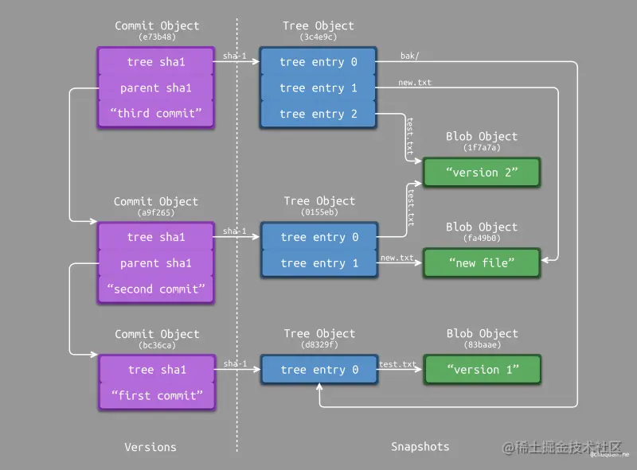
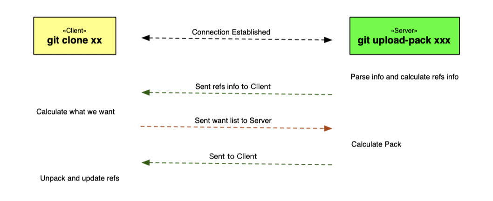
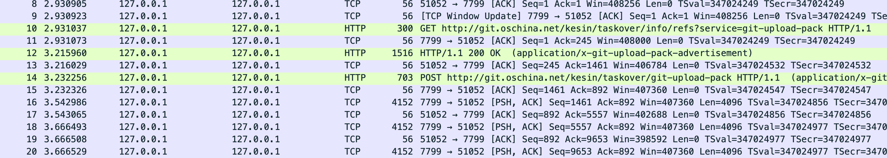
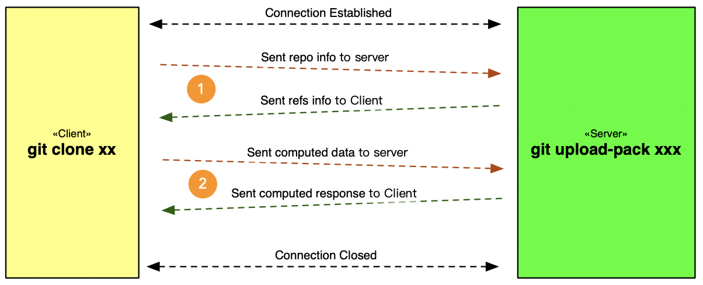
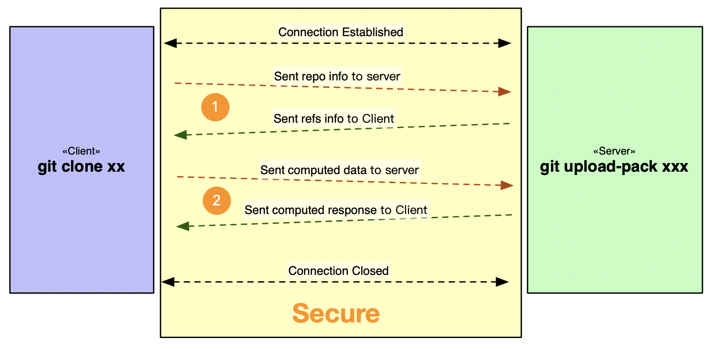
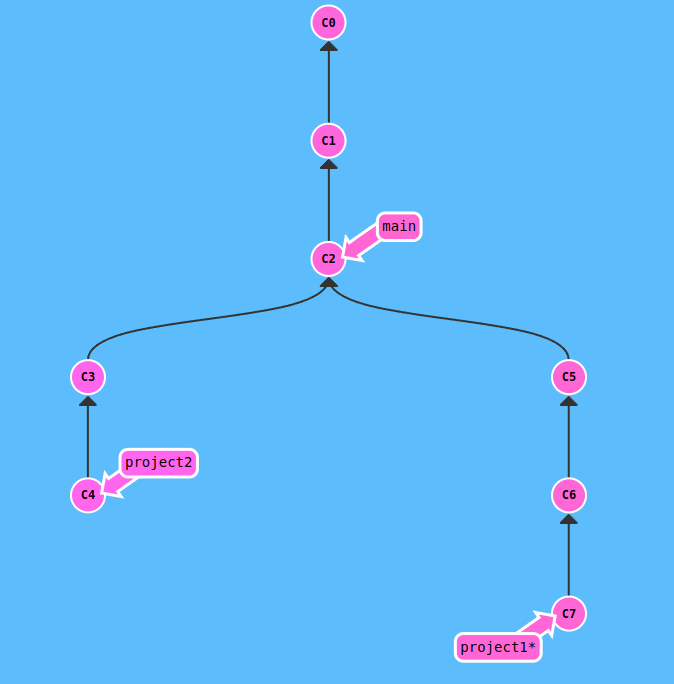

# Git

https://git-scm.com/book/zh/v2/Git-%E5%9F%BA%E7%A1%80-%E8%AE%B0%E5%BD%95%E6%AF%8F%E6%AC%A1%E6%9B%B4%E6%96%B0%E5%88%B0%E4%BB%93%E5%BA%93

https://juejin.cn/post/7103765390748024869

https://www.jianshu.com/p/c18e472fbf19

https://www.atlassian.com/zh/git/tutorials/saving-changes/git-commit

## 摘要      

Git是一种分布式版本控制系统，广泛用于软件开发和团队协作中。本报告介绍了Git的基本原理、常用功能和优势，并探讨了它在软件开发过程中的应用。Git的出现极大地改变了版本控制的方式，为开发人员提供了更高效、灵活和可靠的工具。

## Git概述

### Git的起源

​		Git的诞生离不开Linux开源项目的开发，起初 绝大多数的 Linux 内核维护工作都花在了提交补丁和保存归档的繁琐事务上（1991－2002年间）。 到 2002 年，整个项目组开始启用一个专有的分布式版本控制系统 BitKeeper 来管理和维护代码。

​		到了 2005 年，开发 BitKeeper 的商业公司同 Linux 内核开源社区的合作关系结束，他们收回了 Linux 内核社区免费使用 BitKeeper 的权力。 这就迫使 Linux 开源社区（特别是 Linux 的缔造者 Linus Torvalds）基于使用 BitKeeper 时的经验教训，开发出自己的版本系统。 他们对新的系统制订了若干目标：

- 速度
- 简单的设计
- 对非线性开发模式的强力支持（允许成千上万个并行开发的分支）
- 完全分布式
- 有能力高效管理类似 Linux 内核一样的超大规模项目（速度和数据量）

​		自诞生于 2005 年以来，Git 日臻成熟完善，在高度易用的同时，仍然保留着初期设定的目标。 它的速度飞快，极其适合管理大项目，有着令人难以置信的非线性分支管理系统。

### 版本控制概述

​		版本控制（Version Control），也被称为版本管理或源代码管理，是一种记录和管理软件项目或任何文件的修改历史的系统。它允许开发者跟踪文件的变化、比较不同版本之间的差异、回滚到以前的版本以及合并多个人的修改。它记录一个文件或一组文件随时间的变化，以便用户以后可以调用特定版本。通常情况下我们使用软件源代码作为受版本控制的文件，但实际上可以对计算机上几乎任何类型的文件执行此操作。 对于图形或网页设计师，想要保留图像或布局的每个版本（您肯定想要），那么版本控制系统 (VCS) 允许将选定的文件恢复到以前的状态，将整个项目恢复到以前的状态，比较随时间的变化，查看谁最后修改了可能导致问题的内容，谁在何时引入了问题等等。使用 VCS 通常还意味着，如果用户丢失了文件，可以轻松恢复。

​		很久以前人们就开发了多种本地版本控制系统，大多采用某种简单的数据库来记录文件的历次更新差异。其中最流行的一种叫做 RCS，现今许多计算机系统上都还看得到它的踪影。 RCS 的工作原理是在硬盘上保存补丁集（补丁是指文件修订前后的变化）；通过应用所有的补丁，可以重新计算出各个版本的文件内容。

​		后来发展人们又遇到一个问题，如何让在不同系统上的开发者协同工作？ 于是，集中化的版本控制系统（Centralized Version Control Systems, CVCS）应运而生。 这类系统，诸如 CVS、Subversion 以及 Perforce 等，都有一个单一的集中管理的服务器，保存所有文件的修订版本，而协同工作的人们都通过客户端连到这台服务器，取出最新的文件或者提交更新。 多年以来，这已成为版本控制系统的标准做法。

​		CVC带来了许多好处，特别是相较于老式的本地 VCS 来说。 现在，每个人都可以在一定程度上看到项目中的其他人正在做些什么。 而管理员也可以轻松掌控每个开发者的权限，并且管理一个 CVCS 要远比在各个客户端上维护本地数据库来得轻松容易。

​		显而易见，CVCS最大的缺点是中央服务器的单点故障。 如果宕机一小时，那么在这一小时内，谁都无法提交更新，也就无法协同工作。 如果中心数据库所在的磁盘发生损坏，又没有做恰当备份，毫无疑问你将丢失所有数据——包括项目的整个变更历史，只剩下人们在各自机器上保留的单独快照。 本地版本控制系统也存在类似问题，只要整个项目的历史记录被保存在单一位置，就有丢失所有历史更新记录的风险。

​		于是分布式版本控制系统（Distributed Version Control System，DVCS）腾空出世。 在这类系统中，像 Git、Mercurial、Bazaar 以及 Darcs 等，客户端并不只提取最新版本的文件快照， 而是把代码仓库完整地镜像下来，包括完整的历史记录。 这么一来，任何一处协同工作用的服务器发生故障，事后都可以用任何一个镜像出来的本地仓库恢复。 因为每一次的克隆操作，实际上都是一次对代码仓库的完整备份。

​		分布式版本控制比较适合大型项目，有一部分由独立的工作者所开发，像是Linux核心计划，因为开发者可以独立工作，可以提交其合并修改（或是拒绝他人的合并修改），许多这类系统都可以指定和若干不同的远端代码仓库进行交互。因此，你就可以在同一个项目中，分别和不同工作小组的人相互协作。 你可以根据需要设定不同的协作流程，比如层次模型式的工作流，而这在以前的集中式系统中是无法实现的。

### Git的核心特性

​		Git作为一种版本控制系统，具有多个核心特性，包括分布式版本控制、快速性能、强大的分支管理、数据完整性以及本地操作和离线支持，这些特性使Git成为广泛应用于各种项目和团队的强大工具。

​		分布式版本控制：Git作为分布式版本控制系统，每个开发者都具有完整的代码仓库副本。这意味着开发者可以在本地进行版本控制操作，无需依赖网络连接或中央服务器。这种分布式特性提高了开发的灵活性和效率。

​		快速性能：Git以极快的速度执行操作和命令，这得益于其底层数据结构和高效的算法。Git使用哈希树的数据结构来存储和检索版本控制信息，使得它能够高效地处理大规模的代码库和历史记录。这种快速性能提升了开发过程的效率。

​		强大的分支管理：Git的分支管理是其最强大的特性之一。开发者可以轻松创建、切换和合并分支，而无需担心代码冲突和版本混乱的问题。每个分支都可以独立进行开发，为并行开发和功能测试提供了便利。分支的合并保证了代码的一致性和稳定性。

​		数据完整性：Git使用哈希值标识文件和版本的唯一性，并使用哈希校验验证数据的完整性。这种机制确保了数据的一致性，防止数据损坏和篡改。Git还提供自动修复和恢复数据的功能，保证数据的完整性。

​		本地操作和离线支持：Git的本地操作特性允许开发者在没有网络连接的情况下进行版本控制。开发者可以在本地进行创建、提交和查看历史记录等操作，直到重新连接到网络后将更改推送到远程仓库。这种离线支持使得开发者可以在任何时间和地点工作，而不受网络限制的影响。

---

## Git的内部原理

​		Git是一种分布式版本控制系统，其工作原理基于三个关键要素：底层数据结构、核心命令和操作以及工作流程。通过这些要素的配合，Git实现了高效的版本控制和协作。

### Git对象

​		Git 是一个内容寻址文件系统，其核心部分是一个简单的键值对数据库（key-value data store）。 你可以向 Git 仓库中插入任意类型的内容，它会返回一个唯一的键，通过该键可以在任意时刻再次取回该内容。通常这个作为标识符键是一个唯一的哈希值，这个哈希值是通过SHA-1算法（Secure Hash Algorithm 1）计算得到的，通常是一个40位的十六进制字符串。通过哈希值，Git能够保证每个对象在代码仓库中的唯一性。git有多种对象类型，如 数据对象（blob object），树对象（tree object），提交对象（commit object）等。

​		数据对象（blob object）代表代码仓库中的文件内容。它存储了文件的二进制数据，例如源代码文件或其他文本文件。每个Blob对象都有一个唯一的哈希值，用于标识文件的内容，Git根据文件内容的不同而生成不同的Blob对象。

​		树对象（tree object）代表代码仓库中的目录结构，允许用户将多个文件组织到一起。这是以一种来类似UNIX文件系统的存储内容方式，存储了文件和子目录的引用，每个引用都包含了文件名、文件类型（Blob或子目录的引用）以及对应的哈希值。通过树对象，Git能够构建出整个代码仓库的目录结构，并跟踪文件的变化。因此从概念上讲，Git 内部存储的数据如下图所示：

		

​		提交对象（commit object）代表代码仓库中的一个版本或一个代码提交。除了目录结构，提交对象还包含了作者、提交日期、提交信息等元数据，用于跟踪和描述版本的变化,表示当前版本的目录结构。下图所示，为 Commit Object 与 Tree Object 的关系示意图。每一个 Commit Object 索引一个版本快照，每一个版本快照则是由一个 Tree Object 作为根节点进行构建。不同的版本快照之间会进行数据复用，从而最大限度地节省磁盘空间。每一个 Commit Object 记录了其父版本的索引信息，即另一个 Commit Object 的 SHA-1 值，从而构建了一个完整的版本关系图（有向无环图）。通过版本关系图，我们可以基于一个 Commit Object 回溯其任意历史版本。

​		这些对象通过哈希值和引用相互关联，形成了一个有向无环图结构，记录了代码仓库的版本历史。通过这种数据结构，Git能够高效地存储和检索代码的版本信息，并保证数据的完整性和一致性。这种数据结构为Git提供了高效的版本控制和代码管理能力，使得Git成为一个强大而灵活的版本控制系统。

### Git引用

​		在Git中，引用（Reference）是指对Git对象的命名引用，用于标识和访问代码仓库中的特定版本、分支、标签等。引用在Git中非常重要，它们使得我们可以方便地访问和管理代码的不同状态和历史记录，主要分为分支引用与标签引用两种类型。

​		分支引用是指向某个提交对象的指针，用于标识一个特定的分支。在Git中，分支的本质是一个指向某一系列提交之首的指针或引用，每个分支都有一个对应的分支引用。HEAD文件告诉了git最新提交的SHA-1值，其通常是一个符号引用（symbolic reference），指向目前所在的分支。 所谓符号引用，表示它是一个指向其他引用的指针。分支引用可以在提交历史中移动，随着新的提交的产生，分支引用会指向最新的提交。通过分支引用，我们可以在不同的分支之间进行切换、创建新的分支，以及合并不同的分支。	

​		标签引用是给某个特定的提交对象打上标签，用于标识重要的版本、里程碑或发布。其主体是围绕着第四种对象类型——标签对象（tag object），其非常类似于一个提交对象——它包含一个标签创建者信息、一个日期、一段注释信息，以及一个指针。 主要的区别在于，标签对象通常指向一个提交对象，而不是一个树对象。。与分支引用不同，标签引用是静态的，不会随着新的提交的产生而移动。标签引用可以是轻量标签（Lightweight Tags），只是一个指向特定提交的指针，也可以是附注标签（Annotated Tags），附带了额外的注释和签名信0息。通过标签引用，我们可以方便地访问和引用特定的版本。

### 包文件

​		通过上文对git对象的叙述中，我们得知若对对任意一个文件进行修改，Git 就会创建一个新的 Blob Object，并将该文件的所有内容存储到里面。如果一个文件非常大，而每次只修改其中极小一部分内容，Git便会创建很多Blob Object，而它们的绝大部分的内容都是相同的，因此会存在严重的磁盘空间浪费问题。对于这个问题，Git 采用了增量存储的方式进行了优化。

​		实际上，Git 会不定时地自动对仓库中的对象进行打包并移除（当然也可进行手动进行），最终生成两个文件：

- 包文件（Pack File ）采用 原始内容 + 增量内容 的形式进存储，从而节省存储空间。
- 索引文件（Index File）存储了各个包文件中各个对象的大小、偏移、类型等数据，从而便于重建文件快照和对象关系。

### 传输协议

​		Git 可以通过两种主要的方式在版本库之间传输数据：“哑（dumb）”协议和“智能（smart）”协议。前者之所以被称为“哑”协议，是因为在传输过程中，服务端不需要有针对 Git 特有的代码；抓取过程是一系列 HTTP 的 GET 请求，这种情况下，客户端可以推断出服务端 Git 仓库的布局。智能协议是目前更为常用的传输数据方法，但它需要在服务端运行一个进程，而这也是 Git 的智能之处——它可以读取本地数据，理解客户端有什么和需要什么，并为它生成合适的包文件。 其总共有两组进程用于传输数据，它们分别负责上传和下载数据。

​		另外在使用Git仓库时，不同的协作者需要一个远程仓库，架设一个git服务器。Git可选择四种不同的协议来传输数据：本地协议（Local），HTTP 协议，SSH（Secure Shell）协议及 Git 协议。

#### 本地协议

​		最基本的就是本地协议（Local protocol)，其中的远程版本库就是同一主机上的另一个目录。 这常见于团队每一个成员都对一个共享的文件系统（例如一个挂载的 NFS）拥有访问权，或者比较少见的多人共用同一台电脑的情况。 后者并不理想，因为你的所有代码版本库如果长存于同一台电脑，更可能发生灾难性的损失。

#### HTTP协议

​		HTTP协议分为哑协议与智能协议两种。哑协议只需要一个标准的 HTTP 静态文件服务，这个服务只需要能够提供文件的下载即可，Git 客户端会自动进行文件的遍历和拉取。而智能协议主动权则掌握在服务端，服务端提供的info/refs可以动态更新，并且可以通过客户端传来的参数，决定本次交互客户端所需要的最小对象集，并打包压缩发给客户端，客户端会进行解压来拿到自己想要的数据，整个交互过程如下：

​		通过监听对应端口，我们可以看到整个过程客户端发送了两次请求：

- 引用发现：GET https://gitee.com/kesin/taskover/info/refs?service=git-{upload|receive}-pack
- 数据传输：POST https://gitee.com/kesin/taskover/git-{upload|receive}-pack

​		Git HTTP 协议要求无论是下载操作还是上传操作，都必须先执行引用发现，也就是需要知道服务端的各个引用的版本信息，这样的话才能让服务端或者客户端知道两方之间的差异以及需要什么样的数据。

#### Git与SSH协议

​		Git 协议以及 SSH 协议都是四层的传输协议，而 HTTP 则是七层的传输协议，受限于 HTTP 协议的特点，HTTP 在 Git 相关的操作上存在传输限制、超时等问题，这个问题在大仓库的传输中尤为明显，相比与 HTTP 而言，Git 以及 SSH 协议在传输上更简单而且更稳定。

​		Git 协议最大的优势就是速度快，因为它没有 HTTP 的传输协议的条条框框，也没有 SSH 加解密的成本，但受限于协议的缺点，Git 协议常用于开源项目的下载，不作为私有项目的传输协议。相比于 HTTP 协议，Git 协议直接在四层与服务端建立连接，通过这个长链接直接完成两个步骤，其过程如下图所示：

​		SSH 协议也是应用的比较广泛的一种 Git 传输协议，相比于 Git 协议，SSH 协议从数据传输和权限认证上都相对安全，但是受限于加解密的成本，速度会稍慢，但是这个时间成本在安全面前绝对是可以接受的。与 Git 协议比较，不同点是 SSH 协议传输的数据经过加密，相同点是 SSH 协议的传输过程与 Git 协议一致，都是跟服务端的进程做数据交换：

​		SSH 协议在首次传参的时候与 Git 协议的格式不同，其他情况基本一致，比如引用发现、Packfile 机制、错误处理等等。

## Git的在实际开发的应用

### 个人开发者的使用

​		对于个人开发者来说，Git是一种强大的工具，可以有效地管理个人项目的版本控制和代码管理及备份。通过使用Git，你可以记录每次代码的修改，包括添加、删除和修改文件的操作。这使得你可以随时回退到之前的版本，比较不同版本之间的差异，并且可以查看每个修改的详细信息。

​		

​		如图，假设我们使用Git进行我们一个工程代码的管理，我们可以通过建立不同的分支来进行不同解决方案（图中的project1与projrct2分支）的尝试；同时我们还可以通过版本回退将代码撤回至之前的任意版本（我们可以从C7退回至C6，C5等之前任意的版本），这对于我们的代码修复及开发有着巨大的帮助；同时我们还可将项目代码推送到远程仓库，及时本地文件丢失，也可通过克隆远程仓库来恢复，而且Git的分布式特性允许在多个设备上进行代码同步与备份，保证了代码的安全性与可访问性。

​		总而言之，对于个人开发者，Git的

### 小型团队的使用1

介绍Git在小型团队中的应用，包括多人协作、代码审查和分支管理等。 

### 大型项目和开源项目的使用

讨论Git在大型项目和开源项目中的应用，如分支策略、代码贡献流程和版本发布等。

---

## Git生态系统和工具

### Git的周边工具

介绍Git生态系统中常用的工具，如图形界面客户端、集成开发环境插件和命令行辅助工具。

### Git托管平台

介绍常见的Git托管平台，如GitHub、GitLab和Bitbucket，并探讨它们对开源和协作的影响

---

## 小结