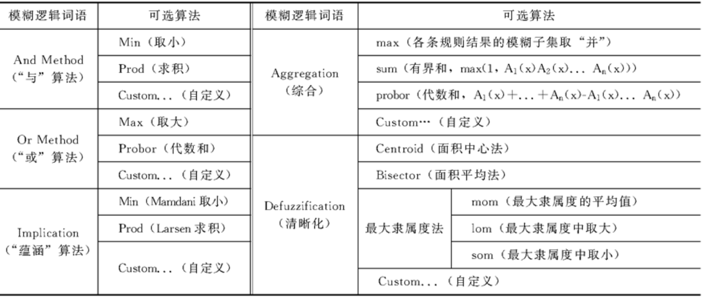
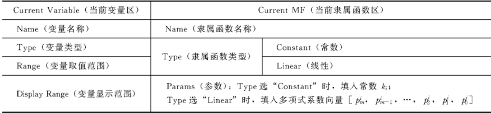
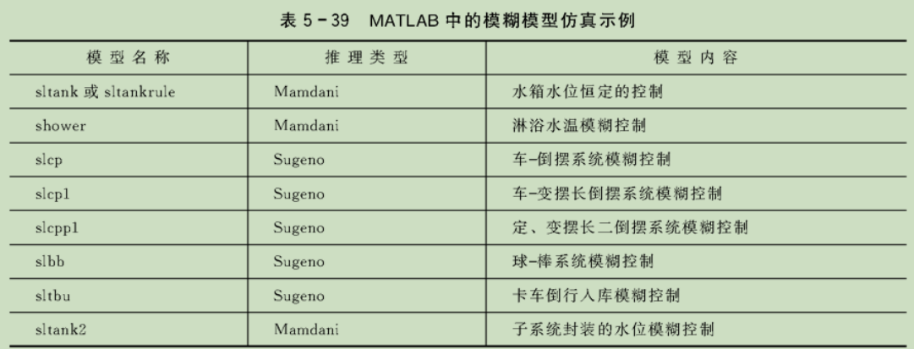

# Simulink常用工具箱

## fuzzyControl工具箱

### 模糊推理系统GUI编辑器

#### GUI界面

在matlab命令行输入`fuzzy`即可进入FIS的GUI。

界面分为菜单条，模块区，模糊逻辑区与当前变量区。

> T-S与Mamdani型的模糊逻辑区与输出量框区存在差异

熟悉编辑FIS输入，输出量的名称与维数。

Mamdani型的模糊逻辑区：

Sugeno型模糊逻辑区

#### 隶属函数编辑器

任意单击输入与输出量模框即可进入MF编辑器。

##### Mamdani型MF的编辑

1. 编辑输入/出变量的论域(Range)与显示范围(Dispaly Range)。

2. 增加覆盖输入/出量模糊子集的数目。

3. 修改隶属函数曲线：命名，MF类型，非标准函数型MF的修编(拖动拐点与修改参数)
4. 修改模糊子集位置：拖动法

##### Sugeno型MF的编辑

两种类型推理的输出结论不大相同，前者输出模糊子集，而后者模糊推理输出的是线性函数。

#### 模糊规则编辑器

输入量与输出量间的模糊蕴含关系R，用F条件命题对他们进行表述。

1. Edit与Options的子菜单列表

   | edit                                  | Options  |                 |
   | ------------------------------------- | -------- | --------------- |
   | Undo                                  | Language | Format          |
   | FIS properties...(调出FIS编辑器)      | English  | Verbose(语言型) |
   | Membership Functions...(调出MF编辑器) | Deutsch  | Symbolic        |
   | Anfis                                 | Francais | Indexed         |

2. 模糊规则的编辑方法

点击Edit-Membership或输入/出框图进入隶属函数编辑器，即可通过点击不同的模糊子集与功能键实现输出与输出模糊子集的添加，删除与修改及论域的调整。

点击Edit-Rules或中间的规则框图即可进入模糊规则编辑器。

#### 模糊规则观测窗

点击View-Rules即可进入模糊规则观测窗，可以看到不同输入后的模糊推理与清晰化结果。

点击上面的surface则可看到模糊规则的三维图

### 模糊控制系统的设计与仿真

#### FIS与Simulink的连接

 一般使用**Fuzzy Logic Controller**,右键点击“**Look Under Mask**”即可看到内部结构，使用时需要把使用GUI编辑的FIS结构文件嵌入模块。

1. 送入工作空间在嵌入
2. 保存到文件在嵌入

#### 构建模糊控制系统的仿真模型图

1. 构建FIS结构文件
2. 构建仿真模型图
3. 进行仿真

熟悉常用模块

#### 通过仿真对系统进行分析

有许许多多的模糊模型仿真示例

## StateFlow工具箱

