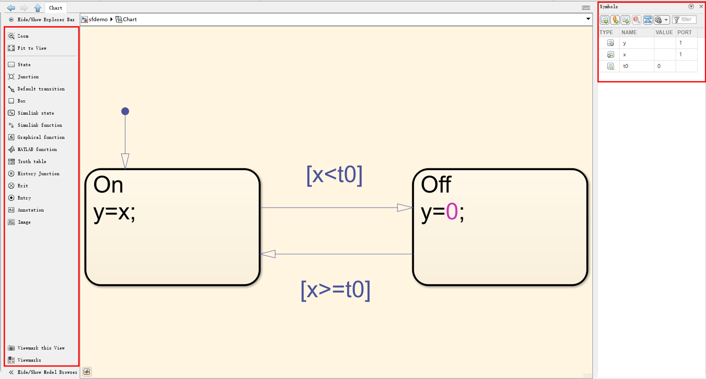
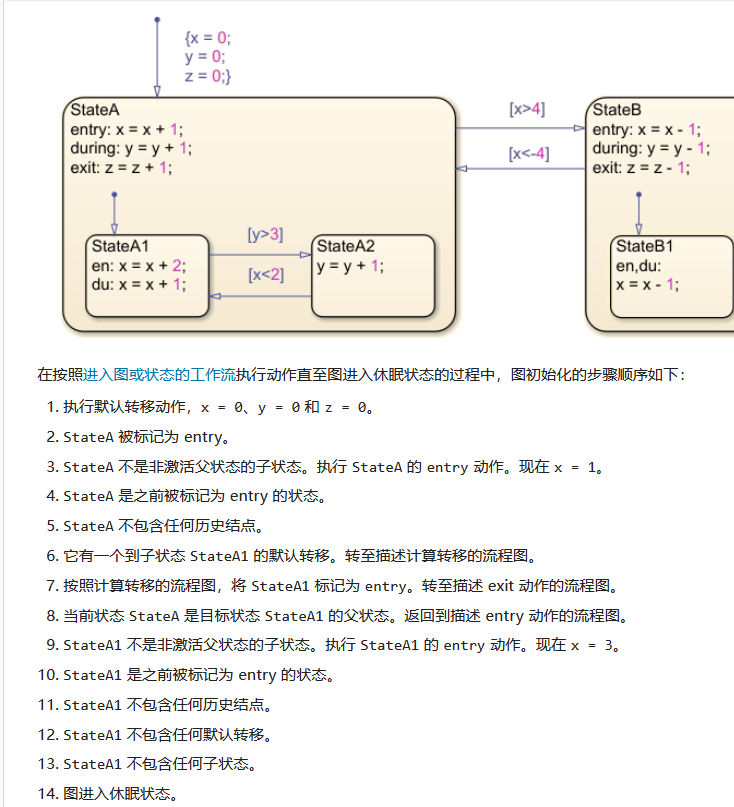
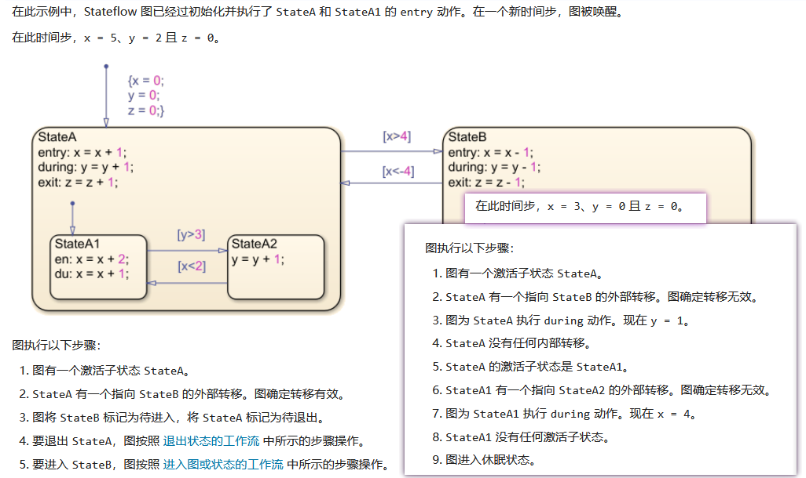
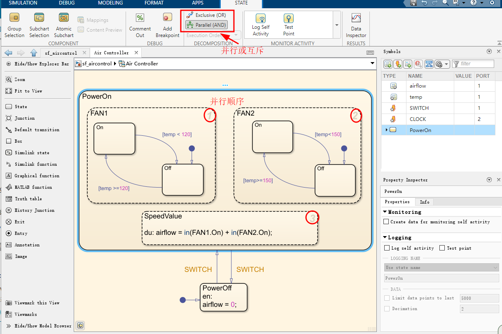
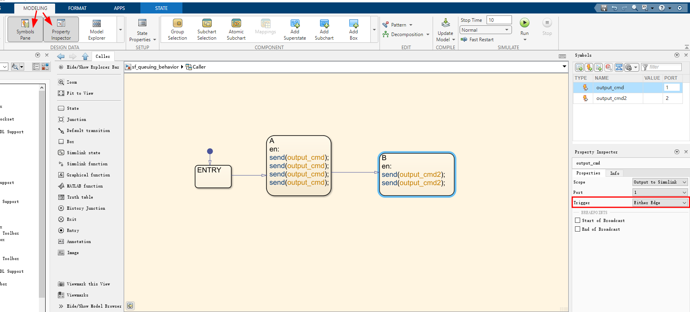
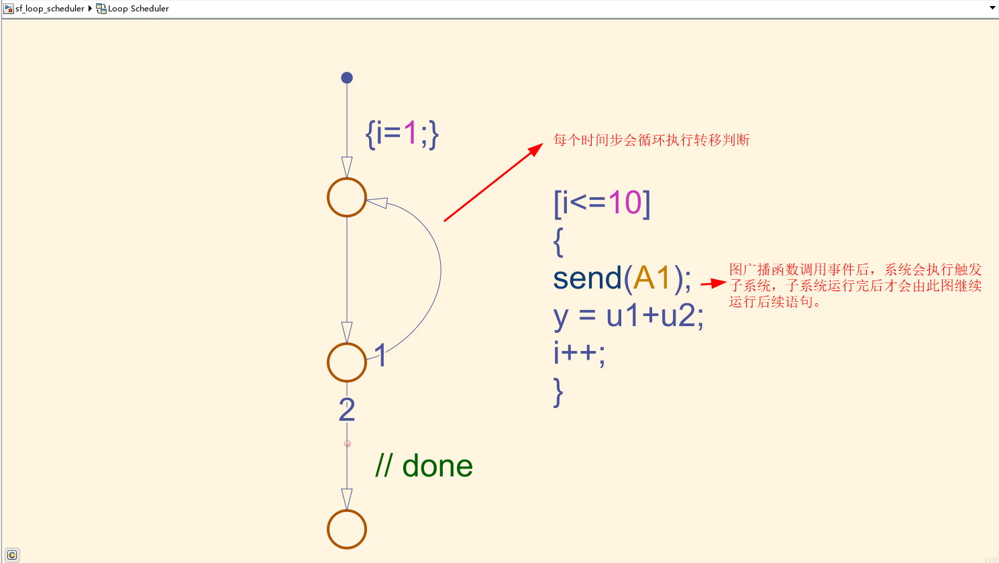
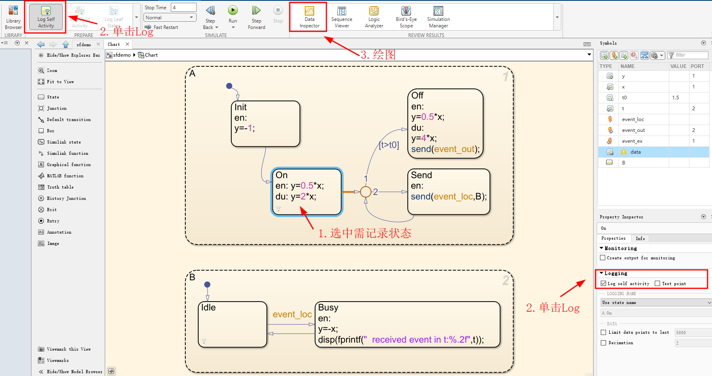
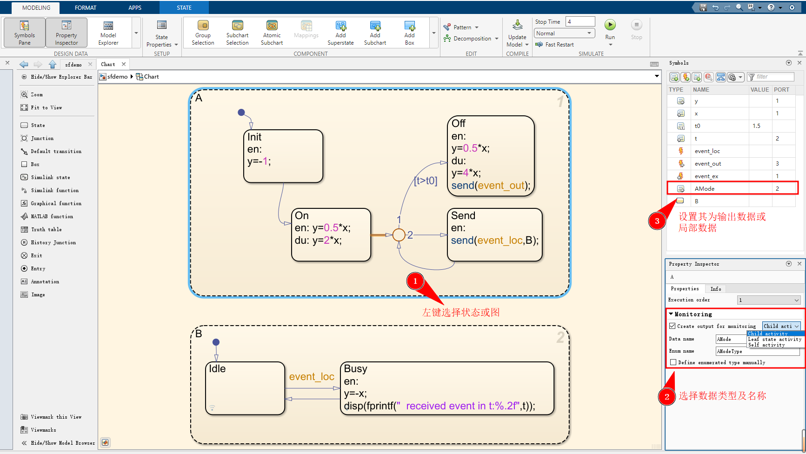
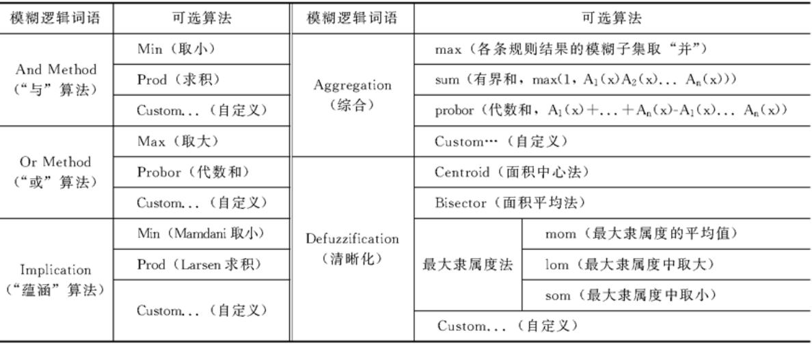

# Simulink常用工具

## StateFlow

### 概述

​		Stateflow 图是有限状态机的图形表示，由状态、转移和数据组成。您可以创建 Stateflow 图来定义 MATLAB 算法或 Simulink模型如何响应外部输入信号、事件和基于时间的条件。Stateflow 编辑器是一个图形环境，用于设计状态转移图、流程图、状态转移表和真值表。在打开 Stateflow 编辑器之前，需要先确定最能满足您需求的图执行模式。

- 要建立周期性或连续时间 Simulink 算法的条件、基于事件和基于时间的逻辑模型，直接在simulink中导入`chart`模块。

- 要为 MATLAB 应用程序设计可重用的状态机和时序逻辑，请使用 [`edit`](https://ww2.mathworks.cn/help/matlab/ref/edit.html) 函数创建可作为 MATLAB 对象执行的独立 Stateflow 图。在 MATLAB 命令提示符处，输入：

	```matlab
	edit sfDemo.sfx  % create chart for execution as a MATLAB object
	```

​		Stateflow编辑器主要包括图画布、对象选项板和符号图窗；图画布是表示Stateflow的绘图区域，左侧的对象选项板是可添加图形元素的工具（空格键可自动自适应大小），右侧的符号图窗则是用来添加或编辑数据、时间和消息的工具，如下图：



​		最简单的`State`模块可用左键拖出，可定义状态名称与状态动作；同时可以在不同的状态间绘制状态转移线，在线上可添加不同的事件名称、转移条件及动作。`Juction`通常是作为分支逻辑和条件判断的选择点；`Default transition`模块则是默认选择子状态的转移线。通常运行需定义图中所有符号的作用域（如输入数据、输出数据或常量数据），通过点击左侧对应的type图表进行修改。

### 状态与转移

​		Stateflow的状态名称由字母数字和下划线字符组合而成，相关规范及保留关键字细节可参考[Stateflow命名规范](https://ww2.mathworks.cn/help/stateflow/ug/rules-for-naming-stateflow-objects.html)。状态内需要定义不同的状态动作，状态动作主要包括entry(en)、during(du)、exit(ex)、on、bind几种类型，通常使用**typename :**后接相应的动作语句，如果直接在状态名称后添加语句，图会将这些语句解释为组合的 `entry` 和 `during` 动作。

- **entry**：状态起始被激活时执行，通常用于执行初始化或准备工作。
- **during**：状态被起始激活后(上一周期时间步执行过`entry`)且没有到另一个状态的有效转移时执行。
- **exit**：状态被激活且发生转出状态的转移时执行。
- **on**：状态被激活且接收到指定的事件或消息时执行，可参考[通过广播事件同步模型组件](https://ww2.mathworks.cn/help/stateflow/ug/how-events-work-in-stateflow-charts.html)和[通过发送消息与 Stateflow 图通信](https://ww2.mathworks.cn/help/stateflow/ug/message-syntax-in-charts.html)。
- **bind**：用于将变量或参数绑定到不同的作用域，以实现数据共享或更改。

​		状态的转移与计算可参考[进入图或状态](https://ww2.mathworks.cn/help/stateflow/ug/chart-initialization-and-entry-actions.html)，[计算转移](https://ww2.mathworks.cn/help/stateflow/ug/evaluate-transitions.html)。**默认转移**是一种没有源的转移。在不包含任何状态的 Stateflow 图中，默认转移标记流程图（子图）的开始，图（子图）仅在进入状态时计算状态内的默认转移路径，而不是在图每次唤醒时计算。**外部转移**是一种退出源状态的转移，需要使用使用状态之间的转移箭头，Stateflow 图将标记待计算的外部转移作为执行状态的**第一步**，没有有效的外部转移才会执行该状态的`during`。**内部转移**是一种不退出源状态的转移，（参阅[Control Chart Execution by Using Inner Transitions](https://ww2.mathworks.cn/help/stateflow/ug/inner-transitions.html)），当前状态执行`during`后会标记待计算的内部转移。通常的转移标签类型为

```
(Event/Message name)[Condition]{ConditionAction} 
```

`Condition` 是布尔表达式，用于确定是否发生转移。如果不指定条件，转移将在源状态被激活后的**下一个时间步**发生。在转移标签语法中，若转移动作以**正斜杠 (`/`) 开头**，并括在花括号前 (`/{action}`)，仅在转移路径确定为有效后，转移动作才会执行（在转移含有条件与动作时下需要避免计算回溯）。 `ConditionAction` 是在判断转移的条件为 true 时执行的指令。条件动作发生在条件后，但在任何 `exit` 或 `entry` 状态动作之前。Stateflow中含有内置的**隐式事件**，可参考[通过使用隐式事件控制图行为](https://ww2.mathworks.cn/help/stateflow/ug/using-implicit-events.html)。

### 子系统与子图

​		类似子系统，也可在Stateflow中创建子图和子状态，创建子状态，请点击状态工具，将新状态拖到要作为其父状态的状态中。当父状态被激活时，子状态之一也被激活。当父状态变为非激活时，所有子状态都变为非激活。在一个时间步长内，**初始化**时父状态被激活时，会优先执行entry（初始化），若无[历史节点](https://ww2.mathworks.cn/help/stateflow/ug/recording-state-activity-with-history-junctions.html)则通过**默认转移**到子状态执行`entry`；初始化后若图**再次被唤醒**，首先判断父状态的的外部转移，无有效转移执行父状态的`during`，之后在被激活的子状态中执行转移或`during`等。

​		一个包含子系统的图初始化如下：



​		一个包含子系统的执行流程如下：



​		如果您需要 Stateflow 图记住并返回到以前激活的子状态，而不考虑默认转移，则应使用**历史结点**。将历史结点置于某状态之内会覆盖指向互斥  (OR) 子状态的默认转移。在将历史结点置于某状态内后，在执行 entry 动作时，您的 Stateflow  图会记住并进入先前激活的子状态。历史结点只会应用到层次结构中其所在的层级。

### 使用状态分解设置子系统的互斥与并行

​		图或状态的分解类型指定图或状态包含互斥状态还是并行状态：**互斥状态**表示互斥的工作模式，同一层级上不能有两个互斥状态同时被激活或执行。Stateflow 图用实线矩形表示每个互斥状态。**并行状态**表示独立的工作模式，虽然并行状态会依次执行，但可以有两个或多个并行状态同时处于激活状态，Stateflow 图用虚线矩形表示每个并行状态，其中的数字表示其执行顺序。

​		子状态的外观指示其父状态的分解，同时需显式指定并行顺序（参考[并行状态的执行顺序](https://ww2.mathworks.cn/help/stateflow/ug/execution-order-for-parallel-states.html)），如下：



### 通过广播事件同步并行状态

​		**局部事件**允许一个状态触发同一个 Stateflow图中另一个状态的转移或动作，从而使您能够**协调并行状态**。要将事件从一个状态广播到另一个状态，请使用 `send` 运算符以及事件的名称和激活状态的名称：

```matlab
send(eventName,stateName)
```

当您广播事件时，该事件将在接收状态以及该状态层次结构中的任何子状态中均生效，注意广播的该事件通常只作用于本次时间步内。局部事件为固定事件类型，无需设置。

​		Stateflow还可以与图外部的事件进行交互，如[接受输入事件](https://ww2.mathworks.cn/help/stateflow/ug/using-input-events-to-activate-a-stateflow-chart.html)或[输出事件](https://ww2.mathworks.cn/help/stateflow/ug/using-output-events-to-activate-a-simulink-block.html)。

​		**输出事件**直接使用`send(eventName)`来广播，每个输出事件对应一个输出端口，在Modeling-Symbols Pane新建对应事件并将其设置为Output Event，右键打开事件的Inspector可配置输出事件`Trigger`属性，可设置为Either Edge（边沿触发）或Function call（函数调用）两种，均可用来传递或激活其他simulink模块，例如[触发子系统](https://ww2.mathworks.cn/help/simulink/ug/triggered-subsystems.html)或[函数调用子系统](https://ww2.mathworks.cn/help/simulink/ug/using-function-call-subsystems.html)。	

- Either Edge：会输出0-1的上升下降沿，触发子系统可以读取上升或者下降沿，或者Either Edge，可作为常量显示。对于每个时间步，图**仅调度**边沿触发输出事件的**一个广播**，若多次广播一个事件时，图只会广播一次该事件，在后续时间步中继续广播该事件（信号0-1的限制）。



- Function call：输出函数调用事件会激活 Simulink 模块，使其在仿真的当前时间步内执行。这种类型的输出事件只对可以使用函数调用触发的模块有效，可参阅[使用函数调用子系统](https://ww2.mathworks.cn/help/simulink/ug/using-function-call-subsystems.html) (Simulink)。当单个时间步中存在某一函数调用输出事件的多个广播时，图会在该时间步内**调度所有广播**（**与边沿触发不同**）。函数调用子系统的执行与图的执行**交叉进行**，因此**函数调用子系统的输出可立即在图中使用**。基于此特性，可以设计一个循环调度器，从而能在一个时间步多次执行函数调用子系统，如下：



​		使用**输入事件**激活Stateflow图，只需要在Symbols中添加一个Input Event，可以将触发器属性设置为上升、下降沿或函数调用。在任意给定时间步，按其端口号升序检查输入事件。对于边沿触发输入事件，同一时间步内可能会出现多个边沿，这会在该时间步内将 Stateflow  图唤醒多次。在这种情况下，事件按其端口号的升序顺序唤醒 Stateflow 图。

### 使用状态激活数据监视图活动

​		Stateflow图中的状态在运行时可以实时显示当前状态，为了更为直观分析状态的转移历史，我们可以通过Data Inspector来记录状态值。Data Inspector可以记录局部数据、输出数据的数值，还可以用来记录状态的activity，如下：



​		如果 Stateflow 图包含与图层次结构相关的数据，则可以使用活动状态数据( **Active State Data**)来简化设计，Stateflow通过输出端口将状态活动报告给Simulink或用作图表中的本地数据。激活状态数据有三种类型：

| Activity Type       | Active State Data Type                                       |
| ------------------- | ------------------------------------------------------------ |
| Self activity       | Boolean                                                      |
| Child activity      | [Enumeration]( [Define State Activity Enumeration Type](https://ww2.mathworks.cn/help/stateflow/ug/about-active-state-data.html#bt5zn9j-1).) |
| Leaf state activity | Enumeration                                                  |

​		您可以为状态流图、状态、状态转换表或原子子图启用活动状态数据，下表列出了每种状态流对象支持的活动类型。

| Stateflow Object                         | Self-Activity                    | Child Activity                | Leaf State Activity           |
| ---------------------------------------- | -------------------------------- | ----------------------------- | ----------------------------- |
| Charts                                   | Not supported                    | Supported                     | Supported                     |
| States with exclusive (OR) decomposition | Supported                        | Supported                     | Supported                     |
| States with parallel (AND) decomposition | Supported                        | Not supported                 | Not supported                 |
| Atomic subcharts                         | Supported at the container level | Supported inside the subchart | Supported inside the subchart |
| State transition tables                  | Not supported                    | Supported                     | Supported                     |



​		输出的枚举类型可在Data Inspector与Scope中直接显示，也可以直接使用`double`模块强制转换为浮点数，通常会涉及到[Memory](https://ww2.mathworks.cn/help/simulink/slref/memory.html)这个模块，用来储存上一时刻的值。Stateflow还提供了操作符`in`来检查状态是否激活（尽量使用状态的完整名称），用法如下：

```matlab
in(state_name) %若状态state_name激活返回1，反之为0
```

### 使用时序逻辑调度

​		定义 Stateflow 图在仿真时间的行为，可在图的状态和转移动作中使用时序逻辑运算符。时间逻辑运算符是内置函数，告诉状态保持活动状态或布尔条件保持为真的时间长度。以下是最常见的绝对时间时序逻辑运算符：

-  [after](https://ww2.mathworks.cn/help/stateflow/ref/after.html) - 如果自包含该运算符的状态或包含该运算符的转移的源状态被激活以来经过的仿真时间达到 `n` 秒，则 `after(n,sec)` 返回 `true`。否则，运算符返回 `false`。此运算符支持以秒 (`sec`)、毫秒 (`msec`) 和微秒 (`usec`) 计的基于事件的时序逻辑和绝对时间时序逻辑。
-  [elapsed](https://ww2.mathworks.cn/help/stateflow/ref/elapsed.html) - `elapsed(sec)` 返回自关联状态激活以来经过的仿真时间的秒数，表达式 `elapsed(sec)` 和 `et` 等效于 `temporalCount(sec)`。
-  [duration]() - `duration(C)` 返回自布尔条件 `C` 变为 `true` 以来经过的仿真时间的秒数。

## **Model Linearizer** 

​		使用 Model Linearizer，您可以分析线性化模型的时域和频域响应。您可以比较多个模型的响应并查看稳定裕度和稳定时间等系统特性。

参考官网链接:[在模型工作点线性化Simulink 模型](https://ww2-mathworks-cn.translate.goog/help/slcontrol/ug/linearize-simulink-model.html?_x_tr_sl=auto&_x_tr_tl=zh-CN&_x_tr_hl=zh-CN),   [使用模型线性化器响应图分析结果使用模型线性化器响应图分析结果](https://ww2-mathworks-cn.translate.goog/help/slcontrol/ug/analyze-results-using-linear-analysis-tool-response-plots-1.html?_x_tr_sl=auto&_x_tr_tl=zh-CN&_x_tr_hl=zh-CN)  [在模型线性化器中指定要线性化的模型部分](https://www-mathworks-com.translate.goog/help/slcontrol/ug/specify-portion-of-model-to-linearize-in-linear-analysis-tool.html?_x_tr_sl=auto&_x_tr_tl=zh-CN&_x_tr_hl=zh-CN)

|                                  | Simulink Control Design Linearization                        |
| -------------------------------- | ------------------------------------------------------------ |
| 图形用户界面                     | 是的。请参阅[在模型工作点线性化 Simulink 模型](https://www-mathworks-com.translate.goog/help/slcontrol/ug/linearize-simulink-model.html?_x_tr_sl=auto&_x_tr_tl=zh-CN&_x_tr_hl=zh-CN)。 |
| 灵活定义模型的哪一部分进行线性化 | 是的。允许您以图形方式或编程方式在 Simulink 模型的任何级别指定线性化 I/O 点，而无需修改您的模型。请参阅[在修整的工作点进行线性化](https://www-mathworks-com.translate.goog/help/slcontrol/ug/linearize-at-trimmed-operating-point.html?_x_tr_sl=auto&_x_tr_tl=zh-CN&_x_tr_hl=zh-CN)。 |
| 开环分析                         | 是的。允许您在不删除模型中的反馈信号的情况下打开反馈回路。请参阅[计算开环响应](https://www-mathworks-com.translate.goog/help/slcontrol/ug/open-loop-response-of-control-system-for-stability-margin-analysis.html?_x_tr_sl=auto&_x_tr_tl=zh-CN&_x_tr_hl=zh-CN)。 |
| 控制线性模型状态排序             | 是的。请参阅[线性化模型中的顺序状态](https://www-mathworks-com.translate.goog/help/slcontrol/ug/state-order-in-linearized-model.html?_x_tr_sl=auto&_x_tr_tl=zh-CN&_x_tr_hl=zh-CN)。 |
| 控制单个块的线性化               | 是的。允许您为模块和子系统指定自定义线性化行为。请参阅[何时指定单个块线性化](https://www-mathworks-com.translate.goog/help/slcontrol/ug/when-to-specify-individual-block-linearization.html?_x_tr_sl=auto&_x_tr_tl=zh-CN&_x_tr_hl=zh-CN)。 |
| 线性化诊断                       | 是的。识别有问题的块并让您检查每个块的线性化值。请参阅[线性化故障排除概述](https://www-mathworks-com.translate.goog/help/slcontrol/ug/linearization-troubleshooting-overview.html?_x_tr_sl=auto&_x_tr_tl=zh-CN&_x_tr_hl=zh-CN)。 |
| 块检测和减少                     | 是的。块缩减检测对整体线性化没有贡献的块，从而产生最小实现。 |
| 多速率模型速率转换算法的控制     | 是的                                                         |

分析点类型：

- **Input Perturbation** — Specifies an additive input to a signal.
- **Output Measurement** — Takes a measurement at a signal.
- **Loop Break** — Specifies a loop opening.
- **Open-Loop Input** — Specifies a loop break followed by an input perturbation.
- **Open-Loop Output** — Specifies an output measurement followed by a loop break.
- **Loop Transfer** — Specifies an output measurement before a loop break followed by an input perturbation.
- **Sensitivity** — Specifies an input perturbation followed by an output measurement.
- **Complementary Sensitivity** — Specifies an output measurement followed by an input perturbation

​		若想要指定开环分析（屏蔽掉外环反馈）或闭环，可利用Open-Loop Input/Output，可以选择以下组合：1.  **Open-Loop Input+Output Measurement** (闭环) 2. **Input Perturbation+Output Measurement**(闭环) 3. **Open-Loop Input+Open-Loop Output **(开环) 4. **Input Perturbation+Open-Loop Output**(开环)

​		对选择的信号插入Input Point / Output Point

- 要指定要线性化的模型部分，首先打开线性化选项卡。为此，在Simulink 窗口的Apps 库中，点击Linearization Manager 。

- 要为信号指定分析点，请点击模型中的信号。然后，在“线性化”选项卡上的“插入分析点”库中，选择分析点的类型。
- 将分析的信号配置为Input Perturbation。将输出信号配置为Open-loop Output。开环输出点是在开环后进行的输出测量，它在不改变模型工作点的情况下消除了反馈信号对线性化的影响。要指定要线性化的模型部分，首先打开线性化选项卡。为此，在 Simulink 窗口的 Apps 库中，点击 Linearization Manager 。

​     Model Linearize进入绘制波特图

实例：


## Matlab中的C++MEX函数

​		C++与Matlab的混合使用，matlab调用c++的动态链接库或者使用C++MEX函数调用Matlab等可以参看[官方链接](https://ww2.mathworks.cn/help/matlab/cpp-language.html?s_tid=CRUX_lftnav)。MEX函数是可以自动加载，可以像任何 MATLAB 函数一样调用的程序，C++MEX其主要依靠[MATLAB Data API](https://ww2.mathworks.cn/help/matlab/matlab-data-array.html)与[MATLAB C++ Engine API](https://ww2.mathworks.cn/help/matlab/cpp-engine-api.html)，前者提供了C++接口来处理MATLAB数据，后者提供了C++11及串联Matlab的诸多功能处理(如使用[matlab::engine::MATLABEngine](https://ww2.mathworks.cn/help/matlab/apiref/matlab.engine.matlabengine_cpp.html)调用matlab函数)。

​		C++MEX函数必须继承基类 [`matlab::mex::Function`](https://ww2.mathworks.cn/help/matlab/apiref/matlab.mex.function.html)且名称为 `MexFunction`的子类，并重写函数调用运算符 `operator()`；MEX 函数的输入和输出作为[`matlab::mex::ArgumentList`](https://ww2.mathworks.cn/help/matlab/apiref/matlab.mex.argumentlist.html) 中的元素进行传递，如下是一个简单的示意：

```cpp
/* MyMEXFunction annotation
 * c = MyMEXFunction(a,b);
 * Adds offset argument a to each element of double array b and
 * returns the modified array c.
*/
#include "mex.hpp"   // Include this file for the C++ MEX API.
#include "mexAdapter.hpp"  // Utility needed for C++ MEX function operator

using namespace matlab::data;   
using matlab::mex::ArgumentList; // input output data type

class MexFunction : public matlab::mex::Function {
public:
    void operator()(ArgumentList outputs, ArgumentList inputs) {
        checkArguments(outputs, inputs);
        const double offSet = inputs[0][0];
        TypedArray<double> doubleArray = std::move(inputs[1]);
        for (auto& elem : doubleArray) {
            elem += offSet;
        }
        outputs[0] = doubleArray;
    }
     void checkArguments(ArgumentList outputs, ArgumentList inputs) {
        // Get pointer to engine
        std::shared_ptr<matlab::engine::MATLABEngine> matlabPtr = getEngine();
        // Get array factory: matlab::data::ArrayFactory Create arrays
        ArrayFactory factory;
        // Check offset argument: First input must be scalar double
        if (inputs[0].getType() != ArrayType::DOUBLE || inputs[0].getNumberOfElements() != 1 || inputs[1].getType() != ArrayType::DOUBLE)
        {
            matlabPtr->feval(u"error",0,
                std::vector<Array>({ factory.createScalar("Input must be scalar double") })); // Call the error() using feval()
        }
    }
};
```

​		然后使用 `mex` 命令编译 .cpp 文件：

```bash
mex -setup C++  # MEX选择c++的编译器
mex demoMEX.cpp # 编译cpp文件生成二进制文件，Windows下为 .mexw64
```

参考链接[C++ MEX 函数](https://ww2.mathworks.cn/help/matlab/matlab_external/c-mex-functions.html)，[知乎S-function使用](https://zhuanlan.zhihu.com/p/511253062)，[2020-02-12-使用C语言写简单S-Function](https://blog.smileland.me/2020/02/12/%E4%BD%BF%E7%94%A8C%E8%AF%AD%E8%A8%80%E5%86%99%E7%AE%80%E5%8D%95S-Function/)

## Simulink中的S-function

​		S-Function属于simulink中的用户自定义模块，是用 MATLAB、C、C++ 或 Fortran  编写的 Simulink 模块的计算机语言描述。使用 mex 实用程序编译为 MEX 文件。S-Function 遵循一般形式，可以适应连续、离散和混合系统。通过遵循一组简单的规则，您可以在 S-Function 中实现算法，并使用  S-Function 模块将其添加到 Simulink 模型。在编写 S-Function 并将其名称放入 S-Function 模块后，您可以使用封装来自定义用户界面（请参阅[Author Block Masks](https://ww2.mathworks.cn/help/simulink/block-masks.html)）。

​		S-Function 定义模块在仿真的不同部分（例如初始化、更新、求导、输出和终止）的行为。Level-2 MATLAB S-function是新版simulink引入的升级版，提供了更多的功能与方法。二者均可以在对应模块窗口定义传递参数，各参数以逗号分割。

​		level-1S-Function的通常形式为`[sys,x0,str,ts]=f(t,x,u,flag,p1,p2,...)`，式中系统根据`flag`调用不同方法，对应关系如下：

| Level-1 Flag | Level-2 Callback Method                               | Description                                                  |
| ------------ | ----------------------------------------------------- | ------------------------------------------------------------ |
| 0            | `setup`                                               | 定义基本 S-Function 块特征，包括采样时间、连续和离散状态的初始条件以及尺寸数组 |
| 1            | `mdlDerivatives`                                      | 计算连续状态变量的导数                                       |
| 2            | `mdlUpdate`                                           | 更新离散状态、采样时间和主要时间步要求                       |
| 3            | `mdlOutputs`                                          | 计算输出                                                     |
| 4            | `mdlOutputs` 方法更新运行时对象的  `NextTimeHit` 属性 | 以绝对时间计算下一次hit的时间。仅当您在`setup`方法中指定可变离散时间采样时间时，才使用此例程。 |
| 9            | `mdlTerminate`                                        | 执行任何必要的模拟结束任务                                   |

在matlab官方文档中给出了sfundsc2.m转换为sfundsc2_level2.m的代码，可在下表对比：

| Code in sfundsc2.m                                           | Code in Level-2 MATLAB file (sfundsc2_level2.m)              |
| ------------------------------------------------------------ | ------------------------------------------------------------ |
| `function [sys,x0,str,ts]= ...  sfundsc2(t,x,u,flag)`        | `function sfundsc2(block)  setup(block);`<br />语法发生更改以接受一个输入参数[block](https://ww2.mathworks.cn/help/simulink/slref/simulink.msfcnruntimeblock.html)，其是 Level-2 MATLAB S-Function 块的**运行时间对象**。 Level-2 MATLAB S-Function 的主体包含一行调用本地`setup`函数。 |
| `switch flag, case 0, [sys,x0,str,ts] = ...   mdlInitializeSizes;` | `function setup(block)`<br /> 标志位为0 调用`setup`方法，level-2不使用switch语句，本地`setup`函数会注册在模拟过程中直接调用回调方法。 |
| `case 2,   sys = mdlUpdate(t,x,u); case 3,   sys = mdlOutputs(t,x,u);` | `block.RegBlockMethod('Outputs' ,@Output); block.RegBlockMethod('Update'  ,@Update);` <br />`setup`函数注册了两个局部函数，分别与标志值2和3关联。 |
| `sizes = simsizes; sizes.NumContStates  = 0; sizes.NumDiscStates  = 1; sizes.NumOutputs     = 1; sizes.NumInputs      = 1; sizes.DirFeedthrough = 0; sizes.NumSampleTimes = 1; sys = simsizes(sizes); x0  = 0; str = []; ts  = [.1 0];` | `setup`函数还初始化了MATLAB第2级s函数的属性:<br />`block.NumInputPorts  = 1; block.NumOutputPorts = 1; block.InputPort(1).Dimensions        = 1; block.InputPort(1).DirectFeedthrough = false; block.OutputPort(1).Dimensions       = 1; block.NumDialogPrms     = 0; block.SampleTimes = [0.1 0];`由于此 S-Function 具有离散状态，因此 `setup` 方法会注册 `PostPropagationSetup` 回调方法来初始化 `DWork` 向量，并注册 `InitializeConditions` 回调方法来设置初始状态值。`block.RegBlockMethod('PostPropagationSetup',... @DoPostPropSetup); block.RegBlockMethod('InitializeConditions', ... @InitConditions);` |
| `sizes.NumDiscStates  = 1;`                                  | `PostPropagationSetup`方法初始化存储单个离散状态的`DWork`向量。<br />`function DoPostPropSetup(block)   %% Setup Dwork  block.NumDworks = 1;  block.Dwork(1).Name = 'x0';   block.Dwork(1).Dimensions      = 1;  block.Dwork(1).DatatypeID      = 0;  block.Dwork(1).Complexity      = 'Real';  block.Dwork(1).UsedAsDiscState = true; ` |
| `x0  = 0;`                                                   | `PostPropagationSetup`方法初始化存储单个离散状态的`DWork`向量。<br />`function InitConditions(block) %% Initialize Dwork  block.Dwork(1).Data = 0 ` |
| `function sys = ...   mdlUpdate(t,x,u) sys = u;     `        | `Update`方法计算离散状态的下一个值。<br />`function Update(block) block.Dwork(1).Data = block.InputPort(1).Data; ` |
| `function sys = ...   mdlOutputs(t,x,u) sys = x;`            | `Outputs` 方法计算输出。<br />`function Outputs(block) block.OutputPort(1).Data = block.Dwork(1).Data;` |

​		A Level-2 MATLAB S-function必须包括`setup`与`Outputs`两个方法，其余方法及对应的C MEX函数可参考[writing-level-2-matlab-s-functions](https://ww2.mathworks.cn/help/simulink/sfg/writing-level-2-matlab-s-functions.html)，官方提供了一个MATLAB S-function模板文件[msfuntmpl_basic.m](edit('msfuntmpl_basic.m'))，用来编写自己的程序(也可以使用sfundemos命令来查看内置的所有模板)。[DWork](https://ww2.mathworks.cn/help/simulink/sfg/dwork-matlab.html#brd2qpw)向量是 S-Function 要求 Simulink 引擎分配给模型中 S-Function 的每个实例的内存块，通常离散变量需使用它，其需在`PostPropagationSetup`方法中初始化向量维度与属性，在`Start` 或 `InitializeConditions` 方法中设定初值，且可在其余方法中调用。[S-Function Concepts](https://ww2.mathworks.cn/help/simulink/sfg/s-function-concepts.html)中介绍了直接馈通对代数环的影响，及采样时间偏移与可变数组的概念。

```matlab
function msfcn_unit_delay(block)
% Level-2 MATLAB file S-Function for unit delay demo.
  setup(block);
%endfunction
function setup(block)
  block.NumDialogPrms  = 1; %对话框参数个数
  block.NumInputPorts  = 1;
  block.NumOutputPorts = 1; %定义输入输出端口

  block.SetPreCompInpPortInfoToDynamic;
  block.SetPreCompOutPortInfoToDynamic;%输入端口和输出端口从模型继承编译属性
  block.InputPort(1).Dimensions        = 1;
  block.InputPort(1).DirectFeedthrough = false; %无直接馈通
  block.OutputPort(1).Dimensions       = 1;
  %block.NumContStates = 1;% Set up the continuous states.
  
  block.SampleTimes = [0.1 0];%[-1 0]表示采用继承的采样时间 [0 0]连续采样时间
  %% Set the block simStateCompliance to default (i.e., same as a built-in block)
  block.SimStateCompliance = 'DefaultSimState';
  %% 注册回调方法
  block.RegBlockMethod('PostPropagationSetup', @DoPostPropSetup);
  block.RegBlockMethod('InitializeConditions', @InitConditions);  
  block.RegBlockMethod('Outputs', @Output);  
  block.RegBlockMethod('Update',  @Update);  
  block.RegBlockMethod('Derivatives', @Derivatives)
%endfunction

function DoPostPropSetup(block)
  %% 初始化离散状态变量，不能在setup方法中初始化离散变量
  block.NumDworks = 1;
  block.Dwork(1).Name = 'x0'; 
  block.Dwork(1).Dimensions      = 1;
  block.Dwork(1).DatatypeID      = 0;
  block.Dwork(1).Complexity      = 'Real';
  block.Dwork(1).UsedAsDiscState = true;
%endfunction

function InitConditions(block)%初始化连续或离散DWork变量的值
  block.Dwork(1).Data = block.DialogPrm(1).Data;
  % block.ContStates.Data(1) = 1.0; %ContStates方法初始化连续变量
%endfunction

%% 连续变量必须声明Derivatives方法来设置导数
function Derivatives(block)
	block.Derivatives.Data(1) = block.InputPort(1).Data;

function Output(block)
  block.OutputPort(1).Data = block.Dwork(1).Data;
%endfunction

function Update(block)
  block.Dwork(1).Data = block.InputPort(1).Data;
%endfunction
```

如下给出一个生成$\ddot{x} = -25\dot{x}+133u(t)+d(t)$的Level-2 S-Function的示例：

```matlab
function chap2_7plantL2(block)
% Level-2 MATLAB file S-Function for \ddot{x} = -25\dot{x}+133u(t)+d(t)。
  setup(block);
function setup(block)
  block.NumDialogPrms  = 0; %对话框参数个数
  block.NumInputPorts  = 1;
  block.NumOutputPorts = 1; %定义输入输出端口
  block.SetPreCompInpPortInfoToDynamic;
  block.SetPreCompOutPortInfoToDynamic;%输入端口和输出端口从模型继承编译属性
  block.InputPort(1).Dimensions        = 1;
  block.InputPort(1).DirectFeedthrough = false; %无直接馈通
  block.OutputPort(1).Dimensions       = 2;
  block.NumContStates = 2;% Set up the continuous states.
  block.SampleTimes = [-1 0];%[-1 0]表示采用继承的采样时间
  %% Set the block simStateCompliance to default (i.e., same as a built-in block)
  block.SimStateCompliance = 'DefaultSimState';
  %% 注册回调方法
  block.RegBlockMethod('InitializeConditions', @InitConditions);  
  block.RegBlockMethod('Outputs', @Output);  
  block.RegBlockMethod('Derivatives', @Derivatives)

function InitConditions(block)%初始化连续或离散DWork变量的值
    block.ContStates.Data = [0 0]; %方法初始化连续变量
%% 连续变量必须声明Derivatives方法来设置导数
function Derivatives(block)
    dt = 50 * sin(block.CurrentTime);      
	block.Derivatives.Data(1) = block.ContStates.Data(2);
    block.Derivatives.Data(2) = -25*block.ContStates.Data(2)+133*block.InputPort(1).Data+dt;
function Output(block) 
    block.OutputPort(1).Data(1)= block.ContStates.Data(1);
    block.OutputPort(1).Data(2)= block.ContStates.Data(2);
```


## fuzzyControl工具箱

### 模糊推理系统GUI编辑器

#### GUI界面

在matlab命令行输入`fuzzy`即可进入FIS的GUI。

界面分为菜单条，模块区，模糊逻辑区与当前变量区。

> T-S与Mamdani型的模糊逻辑区与输出量框区存在差异

熟悉编辑FIS输入，输出量的名称与维数。

Mamdani型的模糊逻辑区：



Sugeno型模糊逻辑区


#### 隶属函数编辑器

任意单击输入与输出量模框即可进入MF编辑器。

##### Mamdani型MF的编辑

1. 编辑输入/出变量的论域(Range)与显示范围(Dispaly Range)。

2. 增加覆盖输入/出量模糊子集的数目。

3. 修改隶属函数曲线：命名，MF类型，非标准函数型MF的修编(拖动拐点与修改参数)
4. 修改模糊子集位置：拖动法

##### Sugeno型MF的编辑

两种类型推理的输出结论不大相同，前者输出模糊子集，而后者模糊推理输出的是线性函数。


#### 模糊规则编辑器

输入量与输出量间的模糊蕴含关系R，用F条件命题对他们进行表述。

1. Edit与Options的子菜单列表

	| edit                                  | Options  |                 |
	| ------------------------------------- | -------- | --------------- |
	| Undo                                  | Language | Format          |
	| FIS properties...(调出FIS编辑器)      | English  | Verbose(语言型) |
	| Membership Functions...(调出MF编辑器) | Deutsch  | Symbolic        |
	| Anfis                                 | Francais | Indexed         |

2. 模糊规则的编辑方法

点击Edit-Membership或输入/出框图进入隶属函数编辑器，即可通过点击不同的模糊子集与功能键实现输出与输出模糊子集的添加，删除与修改及论域的调整。

点击Edit-Rules或中间的规则框图即可进入模糊规则编辑器。

#### 模糊规则观测窗

点击View-Rules即可进入模糊规则观测窗，可以看到不同输入后的模糊推理与清晰化结果。

点击上面的surface则可看到模糊规则的三维图

### 模糊控制系统的设计与仿真

#### FIS与Simulink的连接

 一般使用**Fuzzy Logic Controller**,右键点击“**Look Under Mask**”即可看到内部结构，使用时需要把使用GUI编辑的FIS结构文件嵌入模块。

1. 送入工作空间在嵌入
2. 保存到文件在嵌入

#### 构建模糊控制系统的仿真模型图

1. 构建FIS结构文件
2. 构建仿真模型图
3. 进行仿真

熟悉常用模块

#### 通过仿真对系统进行分析

有许许多多的模糊模型仿真示例


