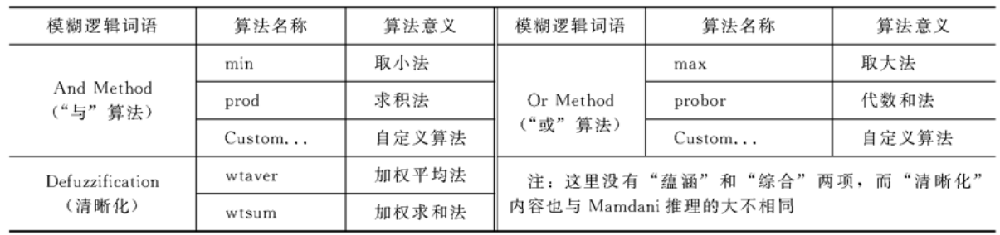
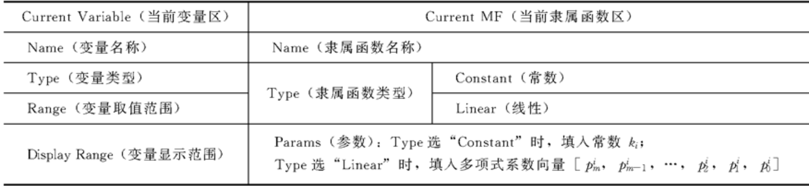
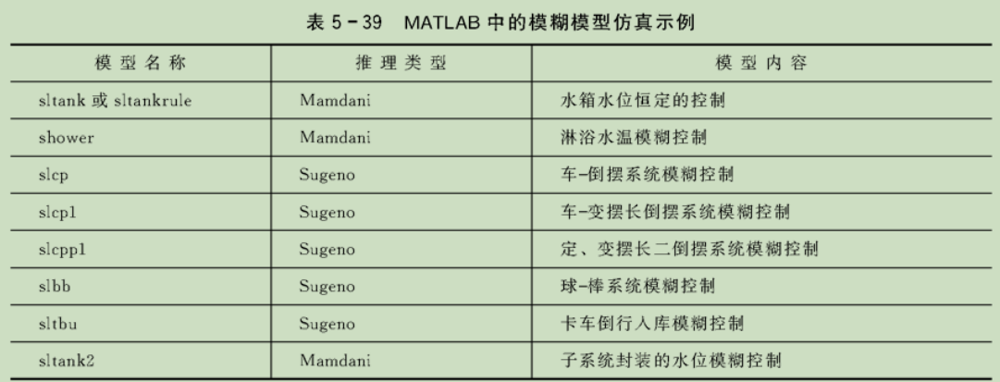
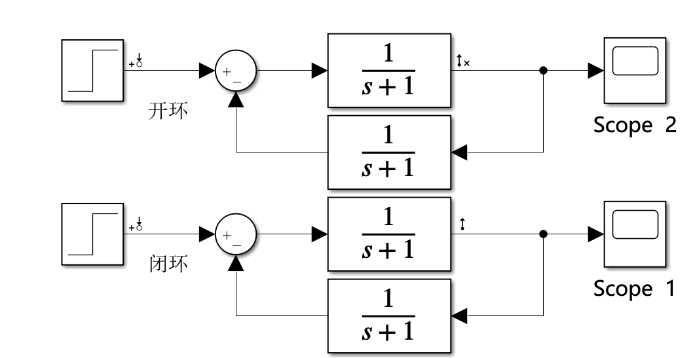

# Simulink常用工具箱

## fuzzyControl工具箱

### 模糊推理系统GUI编辑器

#### GUI界面

在matlab命令行输入`fuzzy`即可进入FIS的GUI。

界面分为菜单条，模块区，模糊逻辑区与当前变量区。

> T-S与Mamdani型的模糊逻辑区与输出量框区存在差异

熟悉编辑FIS输入，输出量的名称与维数。

Mamdani型的模糊逻辑区：

Sugeno型模糊逻辑区

#### 隶属函数编辑器

任意单击输入与输出量模框即可进入MF编辑器。

##### Mamdani型MF的编辑

1. 编辑输入/出变量的论域(Range)与显示范围(Dispaly Range)。

2. 增加覆盖输入/出量模糊子集的数目。

3. 修改隶属函数曲线：命名，MF类型，非标准函数型MF的修编(拖动拐点与修改参数)
4. 修改模糊子集位置：拖动法

##### Sugeno型MF的编辑

两种类型推理的输出结论不大相同，前者输出模糊子集，而后者模糊推理输出的是线性函数。

#### 模糊规则编辑器

输入量与输出量间的模糊蕴含关系R，用F条件命题对他们进行表述。

1. Edit与Options的子菜单列表

	| edit                                  | Options  |                 |
	| ------------------------------------- | -------- | --------------- |
	| Undo                                  | Language | Format          |
	| FIS properties...(调出FIS编辑器)      | English  | Verbose(语言型) |
	| Membership Functions...(调出MF编辑器) | Deutsch  | Symbolic        |
	| Anfis                                 | Francais | Indexed         |

2. 模糊规则的编辑方法

点击Edit-Membership或输入/出框图进入隶属函数编辑器，即可通过点击不同的模糊子集与功能键实现输出与输出模糊子集的添加，删除与修改及论域的调整。

点击Edit-Rules或中间的规则框图即可进入模糊规则编辑器。

#### 模糊规则观测窗

点击View-Rules即可进入模糊规则观测窗，可以看到不同输入后的模糊推理与清晰化结果。

点击上面的surface则可看到模糊规则的三维图

### 模糊控制系统的设计与仿真

#### FIS与Simulink的连接

 一般使用**Fuzzy Logic Controller**,右键点击“**Look Under Mask**”即可看到内部结构，使用时需要把使用GUI编辑的FIS结构文件嵌入模块。

1. 送入工作空间在嵌入
2. 保存到文件在嵌入

#### 构建模糊控制系统的仿真模型图

1. 构建FIS结构文件
2. 构建仿真模型图
3. 进行仿真

熟悉常用模块

#### 通过仿真对系统进行分析

有许许多多的模糊模型仿真示例

## StateFlow工具箱

## **Model Linearizer** 

​		使用 Model Linearizer，您可以分析线性化模型的时域和频域响应。您可以比较多个模型的响应并查看稳定裕度和稳定时间等系统特性。

参考官网链接:[在模型工作点线性化Simulink 模型](https://ww2-mathworks-cn.translate.goog/help/slcontrol/ug/linearize-simulink-model.html?_x_tr_sl=auto&_x_tr_tl=zh-CN&_x_tr_hl=zh-CN),   [使用模型线性化器响应图分析结果使用模型线性化器响应图分析结果](https://ww2-mathworks-cn.translate.goog/help/slcontrol/ug/analyze-results-using-linear-analysis-tool-response-plots-1.html?_x_tr_sl=auto&_x_tr_tl=zh-CN&_x_tr_hl=zh-CN)  [在模型线性化器中指定要线性化的模型部分](https://www-mathworks-com.translate.goog/help/slcontrol/ug/specify-portion-of-model-to-linearize-in-linear-analysis-tool.html?_x_tr_sl=auto&_x_tr_tl=zh-CN&_x_tr_hl=zh-CN)

|                                  | Simulink Control Design Linearization                        |
| -------------------------------- | ------------------------------------------------------------ |
| 图形用户界面                     | 是的。请参阅[在模型工作点线性化 Simulink 模型](https://www-mathworks-com.translate.goog/help/slcontrol/ug/linearize-simulink-model.html?_x_tr_sl=auto&_x_tr_tl=zh-CN&_x_tr_hl=zh-CN)。 |
| 灵活定义模型的哪一部分进行线性化 | 是的。允许您以图形方式或编程方式在 Simulink 模型的任何级别指定线性化 I/O 点，而无需修改您的模型。请参阅[在修整的工作点进行线性化](https://www-mathworks-com.translate.goog/help/slcontrol/ug/linearize-at-trimmed-operating-point.html?_x_tr_sl=auto&_x_tr_tl=zh-CN&_x_tr_hl=zh-CN)。 |
| 开环分析                         | 是的。允许您在不删除模型中的反馈信号的情况下打开反馈回路。请参阅[计算开环响应](https://www-mathworks-com.translate.goog/help/slcontrol/ug/open-loop-response-of-control-system-for-stability-margin-analysis.html?_x_tr_sl=auto&_x_tr_tl=zh-CN&_x_tr_hl=zh-CN)。 |
| 控制线性模型状态排序             | 是的。请参阅[线性化模型中的顺序状态](https://www-mathworks-com.translate.goog/help/slcontrol/ug/state-order-in-linearized-model.html?_x_tr_sl=auto&_x_tr_tl=zh-CN&_x_tr_hl=zh-CN)。 |
| 控制单个块的线性化               | 是的。允许您为模块和子系统指定自定义线性化行为。请参阅[何时指定单个块线性化](https://www-mathworks-com.translate.goog/help/slcontrol/ug/when-to-specify-individual-block-linearization.html?_x_tr_sl=auto&_x_tr_tl=zh-CN&_x_tr_hl=zh-CN)。 |
| 线性化诊断                       | 是的。识别有问题的块并让您检查每个块的线性化值。请参阅[线性化故障排除概述](https://www-mathworks-com.translate.goog/help/slcontrol/ug/linearization-troubleshooting-overview.html?_x_tr_sl=auto&_x_tr_tl=zh-CN&_x_tr_hl=zh-CN)。 |
| 块检测和减少                     | 是的。块缩减检测对整体线性化没有贡献的块，从而产生最小实现。 |
| 多速率模型速率转换算法的控制     | 是的                                                         |

分析点类型：

- **Input Perturbation** — Specifies an additive input to a signal.
- **Output Measurement** — Takes a measurement at a signal.
- **Loop Break** — Specifies a loop opening.
- **Open-Loop Input** — Specifies a loop break followed by an input perturbation.
- **Open-Loop Output** — Specifies an output measurement followed by a loop break.
- **Loop Transfer** — Specifies an output measurement before a loop break followed by an input perturbation.
- **Sensitivity** — Specifies an input perturbation followed by an output measurement.
- **Complementary Sensitivity** — Specifies an output measurement followed by an input perturbation

​		若想要指定开环分析（屏蔽掉外环反馈），可利用Open-Loop Input/Output，可以选择以下组合：1.  **Open-Loop Input+Output Measurement**  2. **Input Perturbation+Output Measurement**

​		对选择的信号插入Input Point / Output Point

- 要指定要线性化的模型部分，首先打开线性化选项卡。为此，在Simulink 窗口的Apps 库中，点击Linearization Manager 。

- 要为信号指定分析点，请点击模型中的信号。然后，在“线性化”选项卡上的“插入分析点”库中，选择分析点的类型。
- 将分析的信号配置为Input Perturbation。将输出信号配置为Open-loop Output。开环输出点是在开环后进行的输出测量，它在不改变模型工作点的情况下消除了反馈信号对线性化的影响。要指定要线性化的模型部分，首先打开线性化选项卡。为此，在 Simulink 窗口的 Apps 库中，点击 Linearization Manager 。

​     Model Linearize进入绘制波特图

实例：

